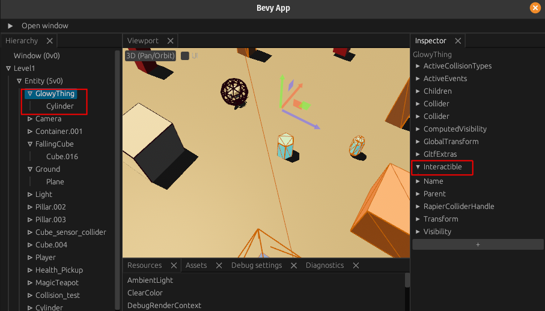
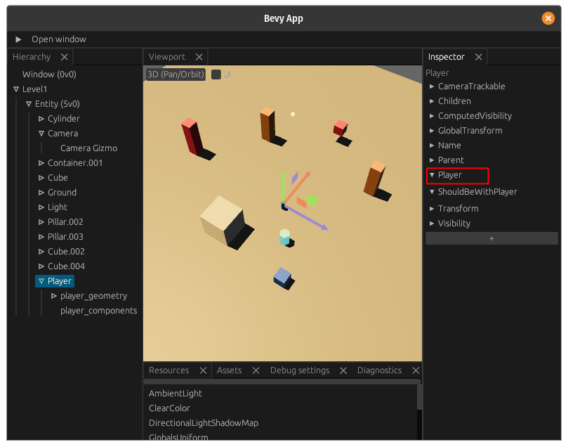
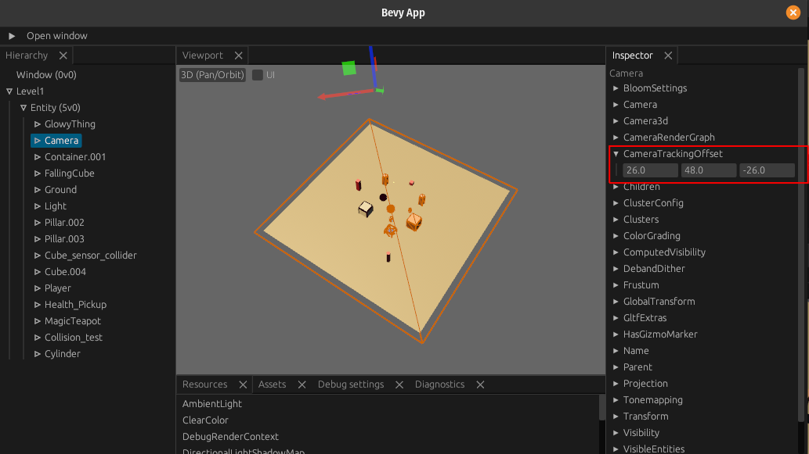

# Workflow: UI

The workflow goes as follows (once you got your Bevy code setup)

## Bevy side
- create & register all your components you want to be able to set from the Blender side (this is basic Bevy, no specific work needed)
- follow the instructions in the [blenvy](./crates/blenvy/) to generate a registry export

## Component creation

Setup the Blender [Blenvy](./tools/blenvy/README.md) blender add-on
to add & edit your components visually & reliably

## Exporting to gltf 

- export your level as a glb/gltf file :
    - using Blender's default gltf exporter
        !!**IMPORTANT** you need to check the following:
        - custom properties
        - cameras & lights if you want a complete level (as in this example)
        
    - or much better, using [blenvy](./tools/blenvy/)

## Now use your gltf files in Bevy

- load it in Bevy (see the various examples for this)
- you should see the components attached to your entities in Bevy

> note: you get a warning if there are any unregistered components in your gltf file (they get ignored)
you will get a warning **per entity**

