# Blender_gltf_components

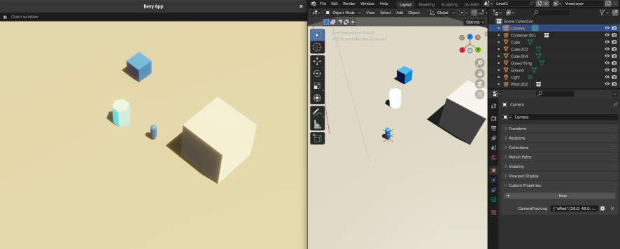


This example, is actually closer to a boilerplate + tooling showcases how to use a minimalistic [Blender](https://www.blender.org/) (gltf) centric workflow for [Bevy](https://bevyengine.org/), ie defining entites & their components
inside Blender using Blender's objects **custom properties**.
Aka "Blender as editor for Bevy"

It also allows you to setup 'blueprints' in Blender by using collections (the recomended way to go most of the time), or directly on single use objects .


## Workflow

The workflow goes as follows (once you got your Bevy code setup)
- add the ```process_gltf``` [module code](./process_gltf/) 
- add the ```ProcessGltfPlugin```, to your app
    ```rust 
    .add_plugins((
        ProcessGltfPlugin
    ))
    ```
    (and any other ```proxy``` processing plugins that you need )
    see [here](./main.rs#69)

- create & register all your components you want to be able to set from the Blender side (this is basic Bevy, no specific work needed)

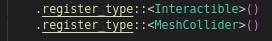


- Create a mesh/ collection (for reuse) in Blender
- Go to object properties => add a **STRING** property, and add your component data
    - unit structs, enums, and more complex strucs / components are all supported, if the fields are basic data types
        - for structs with no params: use ```null``` as a value 
        - for structs with params: use a json representation of your fields (see below) 

        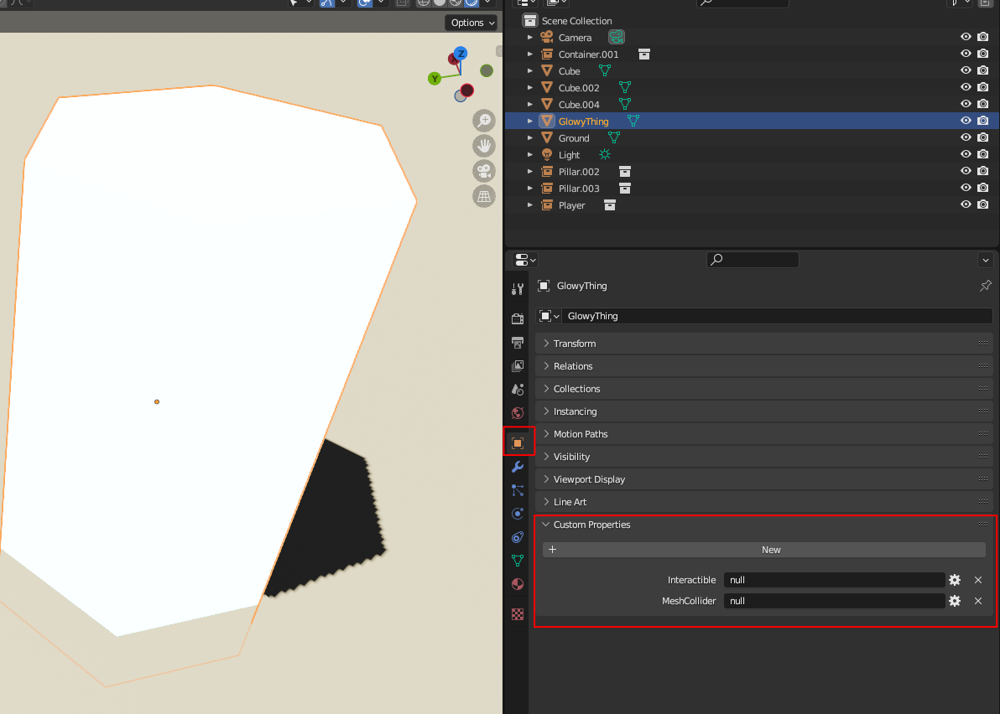

        In rust:

        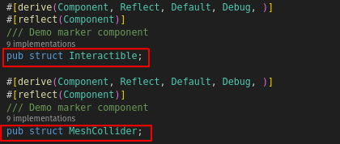

        (the Rust struct for these components for reference is [here](./main.rs#40) )


        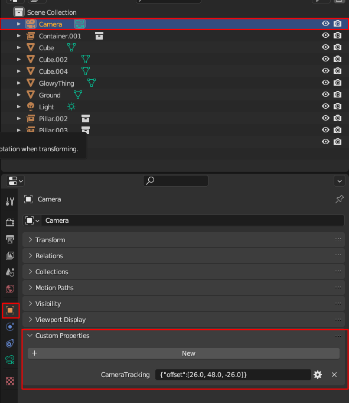

        In rust:

        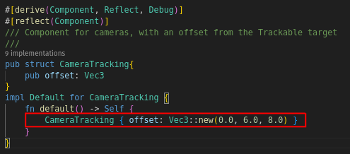

        (the Rust struct for this component for reference is [here](./camera/camera_tracking.rs#14) )

- for collections & their instances: 
    * I usually create a library scene with nested collections
        * the leaf collections are the assets you use in your level
        * add an empty called xxxx_components
        * add the components as explained in the previous part
        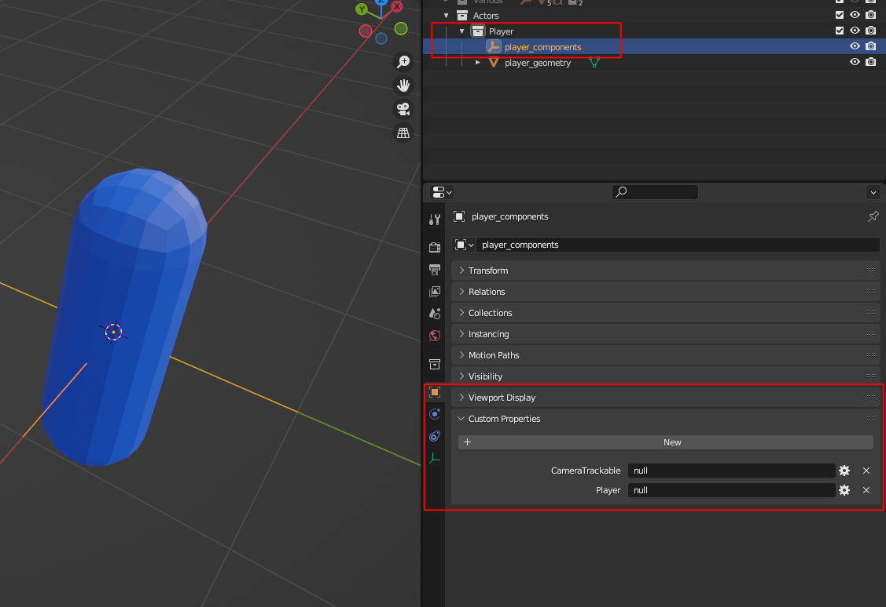

    * In the Level/world itself, just create an instance of the collection (standard Blender, ie Shift+A -> collection instance -> pick the collection)


- export your level as a glb/gltf file :
    !!**IMPORTANT** you need to check the following:
    - custom properties
    - cameras & lights if you want a complete level (as in this example)

    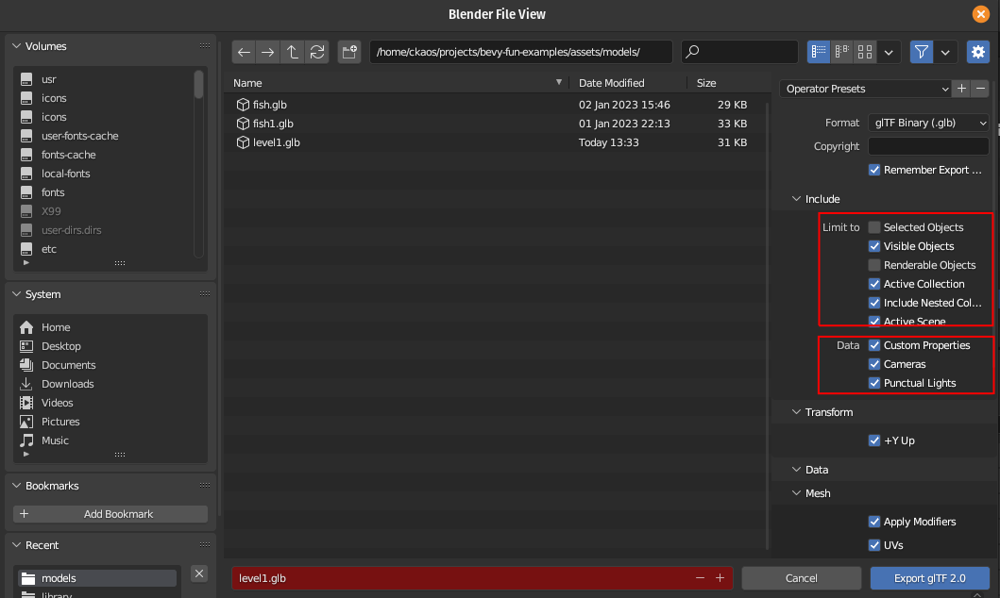


- load it in Bevy (see the demo main file for this)
- you should see the components attached to your entities in Bevy

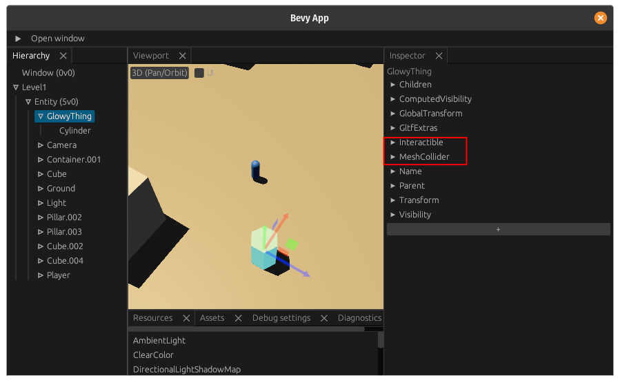

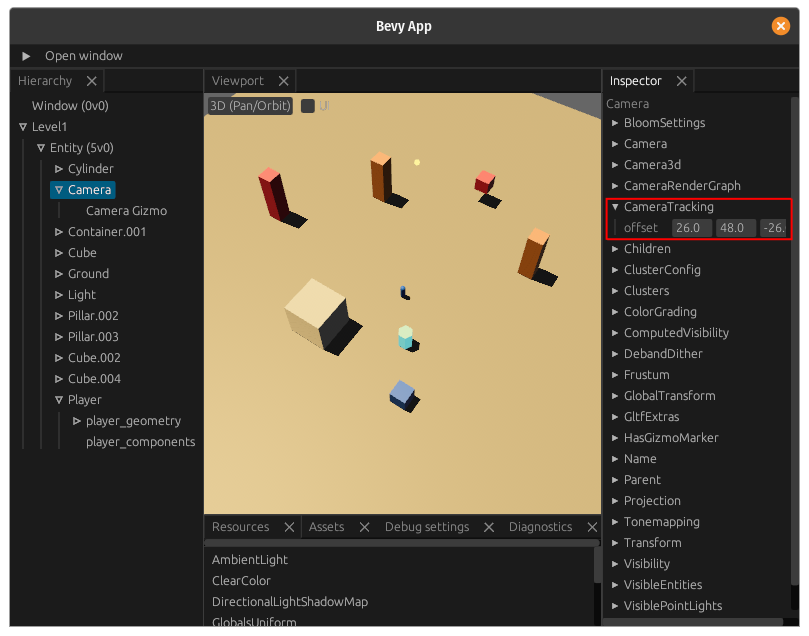


> note: you get a warning if there are any unregistered components in your gltf file (they get ignored)
you will get a warning **per entity**
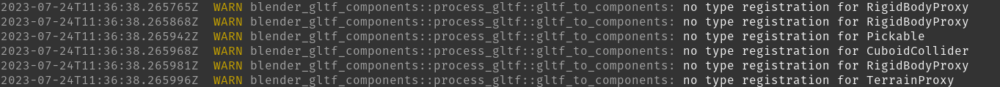


### Additional notes

* You usually define either the Components directly or use ```Proxy components``` that get replaced in Bevy systems with the actual Components that you want

Included are the following modules / tools
 * [```process_gltf```](./process_gltf/) the most important module: this is the one extracting ```component``` information from the gltf files
 * [```insert_dependant_component```](/examples/blender_gltf_components/relationships/relationships_insert_dependant_components.rs)  a small utility to automatically inject 
    components that are dependant on an other component
    for example an Entity with a Player component should also always have a ShouldBeWithPlayer component
    you get a warning if you use this though, as I consider this to be stop-gap solution (usually you should have either a bundle, or directly define all needed components)
 * [```camera```](./camera/) an example post process/replace proxies plugin, for Camera that also adds CameraTracking functions (to enable a camera to follow an object, ie the player)
 * [```lighting```](./lighting/) an other example post process/replace proxies plugin for lighting, that toggles shadows, lighting config, etc so that things look closer to the original Blender data


Feel free to use as you want, rip it appart, use any/all parts that you need !

This tooling and workflow has enabled me to go from a blank Bevy + Blender setup to a working barebones level in very little time (30 minutes or so ?) !
You can then add your own components & systems for your own gameplay very easilly

## Information
- the Bevy/ Rust code is [here](/examples/blender_gltf_components/main.rs)
- the Blender file is [here](../../assets/models/level.blend)
- I added [bevy_editor_pls](https://github.com/jakobhellermann/bevy_editor_pls) as a dependency for convenience so you can inspect your level/components


## Limitations / issues
- the components have to be defined in ```JSON``` in Blender, which is a relic of my initial implementation, not very practical, rather verbose, will likely try switching to RON at some point, or even use the AppTypeRegistry and some Python code on the Blender side for a nicer UI (although this loses the "fast & easy, no tooling" approach)
- the asset management in this example is stripped down for demo purposes, I normally use https://github.com/NiklasEi/bevy_asset_loader to define, organise and preload assets
(in a different state that comes before the actual game/level), so you will see some of the changes to the level/scene "flash by" 
- I did not include `bevy_rapier`/physics code that I usually use to trim down the demo, but I kept some of the proxy items in the Blender scene, might add physics back as I wanted a cleaner way to define colliders from within Blender (currently it also goes via json)

## Future work
- I have a number of other tools/ code  helpers that I have not yet included here, because they need cleanup/ might make this example too complex
 * gltf spawning tools where you just need to preload gltf files then you can spawn 1...n entities defined in gltf files by name (for example enemies, powerups, etc)
 * simplified animation logic: ie instead of having to manually specify the animations you need from a gltf file, it is integrated with the spawning system above, which creates a ```Animations``` component in all entities that have an ```AnimationPlayer``` and you can simply query for both to easilly control your animations per entity.

## Credits

- somebody I cannot recall helped me originally with the gltf loading tracker in the Bevy Discord, so thanks ! And if it was you, please let me know so I can give credit where credit is due :)

## License

This example, all its contents & assets is licensed under MIT.