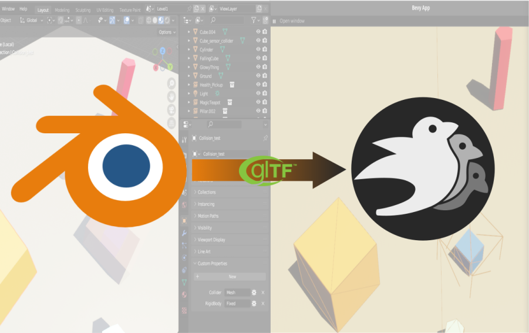

[](https://github.com/bevyengine/bevy/blob/main/docs/plugins_guidelines.md#main-branch-tracking)
[](https://github.com/kaosat-dev/Blender_bevy_components_workflow/blob/main/LICENSE.md)
[](https://ko-fi.com/F1F5TO32O)

# Blenvy: a Blender <=> bevy components workflow



Crates & tools for adding components from gltf files in the [Bevy](https://bevyengine.org/) game engine.

It enables minimalistic [Blender](https://www.blender.org/) (gltf) centric workflow for Bevy, ie defining entites & their components
inside Blender using Blender's objects **custom properties**. 
Aka "Blender as editor for Bevy"

It also allows you to setup 'blueprints' in Blender by using collections (the recomended way to go most of the time), or directly on single use objects .

## Features

* Useful if you want to use Blender (or any editor allowing to export gltf with configurable gltf_extras) as your Editor
* define Bevy components as custom properties in Blender (some visually , some using RON, though an older JSON version is also available)
* now also with an UI tool to add & edit Bevy components, automatically export gltf blueprints & more in [Blender](./tools/blenvy/README.md)
* define components in Blender Collections & override any of them in your collection instances if you want
* ability to automatically turn your Blender collections into [gltf Blueprints](./crates/bevy_gltf_blueprints/README.md) for reuse
* minimal setup & code,  you can have something basic running fast
* minimal dependencies: Bevy, Serde & Ron only !
* opensource 


## Crates

- [bevy_gltf_components](./crates/bevy_gltf_components/) This crate allows you to define components direclty inside gltf files and instanciate/inject the components on the Bevy side.

    There is a [video tutorial/explanation](https://youtu.be/-lcScjQCA3c) if you want, or you can read the crate docs.
    The examples for the crate are [here](./examples/bevy_gltf_components/)

- [bevy_gltf_blueprints](./crates/bevy_gltf_blueprints/) This crate adds the ability to define Blueprints/Prefabs for Bevy inside gltf files and spawn them in Bevy. With the ability to override and add components when spawning, efficient "level" loading etc

    There is a [video tutorial/explanation](https://youtu.be/CgyNtwgYwdM) for this one too, or you can read the crate docs
    The examples for the crate are [here](./examples/bevy_gltf_blueprints/)
    > Note: this is the recomended crate to use and uses ```bevy_gltf_components``` under the hood

- [bevy_gltf_save_load](./crates/bevy_gltf_save_load/) This crate adds the ability to save & load your game state in a relatively simple way, by leveraging the blueprint functionality of 
bevy_gltf_blueprints to only save a minimal subset of dynamic data, seperating dynamic & static parts of levels etc.
The examples for the crate are [here](./examples/bevy_gltf_save_load/)
    > Note: this uses ```bevy_gltf_blueprints``` under the hood

- [bevy_registry_export](./crates/bevy_registry_export/) This crate adds the ability to export your project's Bevy registry to json, in order to be able to generate custom component UIs on the Blender side in the Blender [blenvy](./tools/blenvy/README.md) add-on
 

## Tools

### Blender: blenvy

- an all in one [Blender addon](./tools/blenvy/README.md) for the Blender side of the workflow: 
    - allow easilly adding & editing Bevy components , using automatically generated UIs for each component
    - automatically exports your level/world from Blender to gltf whenever you save your Blend file
    - it also supports automatical exports of collections as [Gltf blueprints](./crates/bevy_gltf_blueprints/README.md) &

Please read the [README]((./tools/blenvy/README.md)) of the add-on for installation & use instructions


## Examples

you can find all examples, by crate as seperate crates for clearer dependencies in [here](./examples/)

- [bevy_gltf_components](./examples/bevy_gltf_components/) 
    * [basic](./examples/bevy_gltf_components/basic/) use of ```bevy_gltf_components``` only, to spawn entities with components defined inside gltf files

- [bevy_gltf_blueprints](./examples/bevy_gltf_blueprints/) 
    * [basic](./examples/bevy_gltf_blueprints/basic/) more advanced example : use of ```bevy_gltf_blueprints``` to spawn a level and then populate it with entities coming from different gltf files, live (at runtime) spawning of entities etc
    * [animation](./examples/bevy_gltf_blueprints/animation/) how to use and trigger animations from gltf files (a feature of ```bevy_gltf_blueprints```)
    * & lots more

- [bevy_gltf_save_load](./examples/bevy_gltf_save_load/) 

- [bevy_registry_export](./examples/bevy_registry_export/) 


## Workflow

The workflow goes as follows (once you got your Bevy code setup)

- create & register all your components you want to be able to set from the Blender side (this is basic Bevy, no specific work needed)


- then you have two options
    - add your components to objects in Blender **manually** as **custom properties**  : see [here](./README-workflow-classic.md) for more details
    - add your components to objects in Blender **with a nice UI** see [here](./README-workflow-ui.md) for more details 

## Limitations / issues
- Some of `bevy_rapier`/physics code / ways to define colliders could perhaps be done better/visually within Blender (currently it also goes via RON)

## Future work
- I have a number of other tools/ code  helpers that I have not yet included here, because they need cleanup/ might make this example too complex

## Credits

- somebody I cannot recall helped me originally with the gltf loading tracker in the Bevy Discord, so thanks ! And if it was you, please let me know so I can give credit where credit is due :)

## Contributors

Thanks to all the contributors helping out with this project ! Big kudos to you, contributions are always appreciated ! :)

- [GitGhillie](https://github.com/GitGhillie)
- [Azorlogh](https://github.com/Azorlogh)
- [BSDGuyShawn](https://github.com/BSDGuyShawn)
- [yukkop](https://github.com/yukkop)
- [killercup](https://github.com/killercup)
- [janhohenheim ](https://github.com/janhohenheim)

## License

This repo, all its code, contents & assets is Dual-licensed under either of

- Apache License, Version 2.0, ([LICENSE-APACHE](./LICENSE_APACHE.md) or https://www.apache.org/licenses/LICENSE-2.0)
- MIT license ([LICENSE-MIT](./LICENSE_MIT.md) or https://opensource.org/licenses/MIT)
