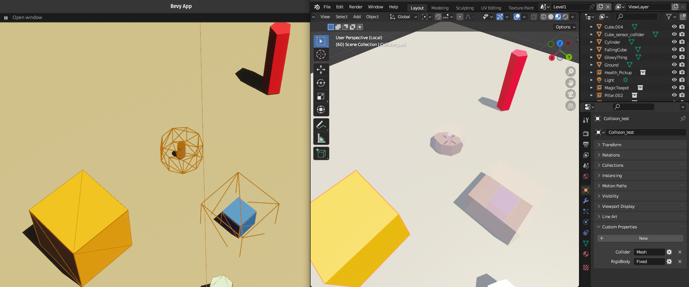
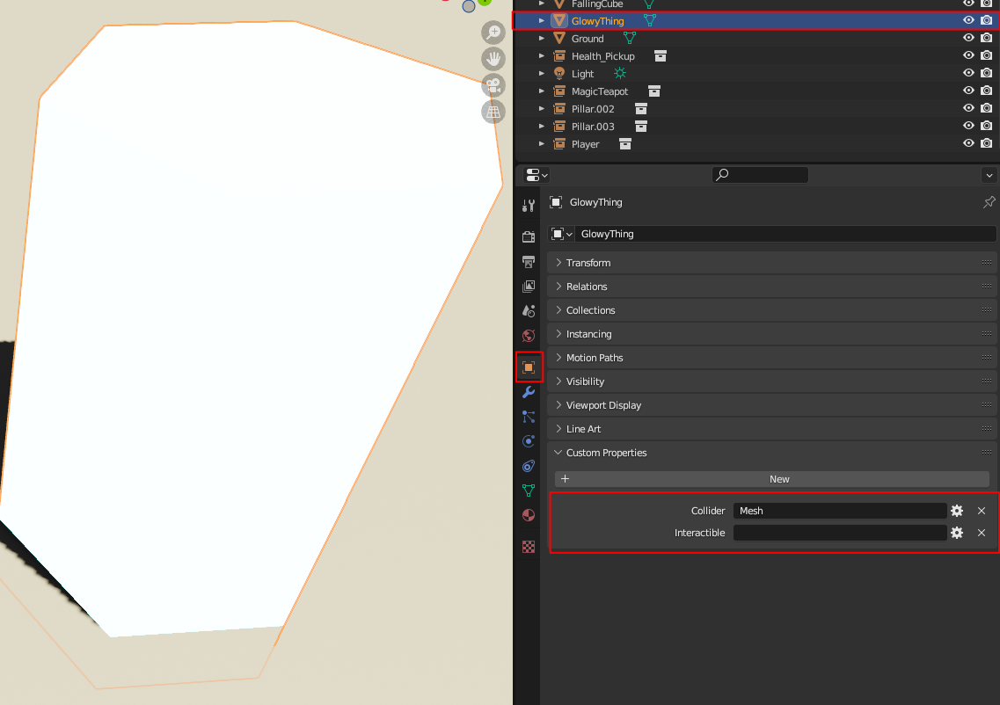
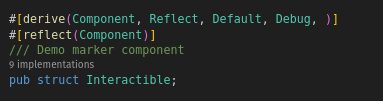
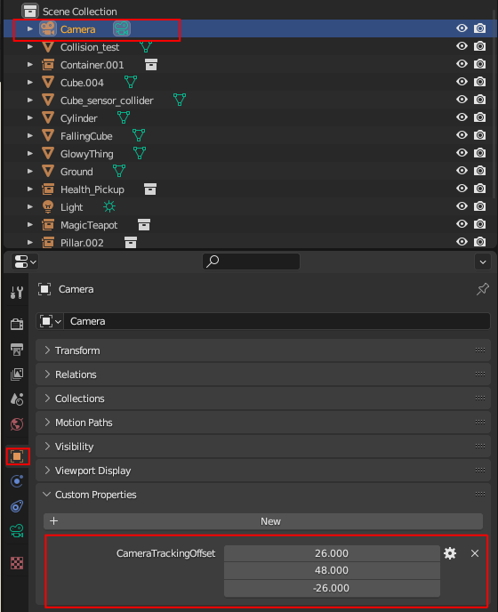
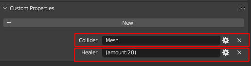

[](https://github.com/bevyengine/bevy/blob/main/docs/plugins_guidelines.md#main-branch-tracking)


# bevy_gltf_components



A plugin & tools for adding components from gltf files in the [bevy](https://bevyengine.org/) game engine.

It enables minimalistic [Blender](https://www.blender.org/) (gltf) centric workflow for Bevy, ie defining entites & their components
inside Blender using Blender's objects **custom properties**. 
Aka "Blender as editor for Bevy"

It also allows you to setup 'blueprints' in Blender by using collections (the recomended way to go most of the time), or directly on single use objects .

## Features

* Useful if you want to use Blender (or any editor allowing to export gltf with configurable gltf_extras) as your Editor
* define Bevy components as custom properties in Blender (RON, though an older JSON version is also available)
* no plugin or extra tools needed in Blender (but I provide a little Blender plugin to auto-export to gltf on save if you want !)
* define components in Blender Collections & override any of them in your collection instances if you want
* minimal setup & code,  you can have something basic running fast

## Usage

***important*** : the plugin for processing gltf files runs in ***update*** , so you cannot use the components directly if you spawn your scene from gltf in ***setup*** (the additional components will not show up)
Please see the included example or use bevy_asset_loader for a reliable workflow

1. Add the crate to your dependencies
```toml
[dependencies]
bevy_gltf_components = { git="https://github.com/kaosat-dev/Blender_bevy_components_worklflow.git" }

```
(not on crates.io yet !)

2. Import 

```rust
use bevy_gltf_components::ComponentsFromGltfPlugin;
```

3. Add the plugin
```rust
.add_plugin(ComponentsFromGltfPlugin)
```

### Example (without bevy_asset_loader)

See [here](./examples/general/main.rs) for more details

 ```rust
use bevy::prelude::*;
use bevy_gltf_components::ComponentsFromGltfPlugin;


#[derive(Component, Reflect, Default, Debug, Deref, DerefMut)]
#[reflect(Component)]
struct TuppleTestF32(f32);

#[derive(Component, Reflect, Default, Debug, )]
#[reflect(Component)]
/// helper marker component, for demo only
pub struct LoadedMarker;


#[derive(Debug, Clone, Copy, Default, Eq, PartialEq, Hash, States)]
enum AppState {
    #[default]
    Loading,
    Running,
}

fn main(){
    App::new()
    .add_plugins((
        DefaultPlugins,
        ComponentsFromGltfPlugin,
    ))

    .add_state::<AppState>()
    .add_systems(Startup, setup)
    .add_systems(Update, (
        spawn_level.run_if(in_state(AppState::Loading)),
    ))
    .run();
}

#[derive(Resource)]
struct AssetLoadHelper(Handle<Scene>);
// we preload the data here, but this is for DEMO PURPOSES ONLY !! Please use https://github.com/NiklasEi/bevy_asset_loader or a similar logic to seperate loading / pre processing 
// of assets from the spawning
// AssetLoadHelper is also just for the same purpose, you do not need it in a real scenario
// the states here are also for demo purposes only, 
fn setup(
    mut commands: Commands,
    asset_server: Res<AssetServer>,
) {

    let tmp: Handle<Scene>  = asset_server.load("models/level1.glb#Scene0");
    commands.insert_resource(AssetLoadHelper(tmp));
}

fn spawn_level(
    mut commands: Commands,
    scene_markers: Query<&LoadedMarker>,
    preloaded_scene: Res<AssetLoadHelper>,

    mut asset_event_reader: EventReader<AssetEvent<Gltf>>,
    mut next_state: ResMut<NextState<AppState>>,
){

    if let Some(asset_event) = asset_event_reader.iter().next() {
        match asset_event {
            AssetEvent::Created { handle: _ } => {
                info!("GLTF loaded");
                if scene_markers.is_empty() {
                    info!("spawning scene");
                    commands.spawn(
                        (
                            SceneBundle {
                                scene: preloaded_scene.0.clone(),
                                ..default()
                            },
                            LoadedMarker,
                            Name::new("Level1")
                        )
                    );
                    next_state.set(AppState::Running);
                }
            }
            _ => ()
        }
    }
}


```


### Example (with bevy_asset_loader, recommended for ease of use)

- follow [bevy_asset_loader's](https://github.com/NiklasEi/bevy_asset_loader) docs to setup your gltf asset loading
- also add this plugin

 ```rust
use bevy::prelude::*;
use bevy_gltf_components::ComponentsFromGltfPlugin;

// replace this with your actual states !
#[derive(Debug, Clone, Copy, Default, Eq, PartialEq, Hash, States)]
enum AppState {
    #[default]
    Loading,
    Running,
}


fn main(){
    App::new()
    .add_plugins((
        DefaultPlugins,
        ComponentsFromGltfPlugin,
    ))
    // do the setup for bevy_asset_loader
    .add_system(setup_game.in_schedule(OnEnter(AppState::Running)))

    .run();
}


pub fn setup_game(
    mut commands: Commands,
    game_assets: Res<GameAssets>, // assets with your "world" or "level" gltf for example
) {
  

    // more fast approach, load the game seperatly
    commands.spawn((
        SceneBundle {
            scene: game_assets.world.clone(),
            ..default()
        },
        bevy::prelude::Name::from("world"),
    ));

}
   

```

# Workflow with blender / demo information

This example, is actually closer to a boilerplate + tooling showcases how to use a minimalistic [Blender](https://www.blender.org/) (gltf) centric workflow for [Bevy](https://bevyengine.org/), ie defining entites & their components
inside Blender using Blender's objects **custom properties**.
Aka "Blender as editor for Bevy"

It also allows you to setup 'blueprints' in Blender by using collections (the recomended way to go most of the time), or directly on single use objects .

## Features

* Useful if you want to use Blender (or any editor allowing to export gltf with configurable gltf_extras) as your Editor
* define Bevy components as custom properties in Blender (RON, though an older JSON version is also available)
* no plugin or extra tools needed in Blender (but I provide a little Blender plugin to auto-export to gltf on save if you want !)
* define components in Blender Collections & override any of them in your collection instances if you want
* code to auto add additional required components in Bevy (if B is needed with A but B is not present, it adds it:  optional & configurable)
* minimal setup & code,  you can have something basic running fast
* opensource 

There is a [video tutorial/explanation](https://youtu.be/-lcScjQCA3c) if you want, or you can skip to the text version ahead


## Workflow

The workflow goes as follows (once you got your Bevy code setup)

### All core/helper modules

see the [example](./examples/general/) for more information on how to set things up


### Then...

- create & register all your components you want to be able to set from the Blender side (this is basic Bevy, no specific work needed)


- Create a mesh/ collection (for reuse) in Blender
- Go to object properties => add a property, and add your component data
    - unit structs, enums, and more complex strucs / components are all supported, (if the fields are basic data types at least,
    have not tried more complex ones yet, but should also work)
        - for structs with no params (unit structs): use a **STRING** property & an empty value 
        - for structs with params: use a RON representation of your fields (see below) 
        - for tupple strucs you can use any of the built in Blender custom property types: Strings, Booleans, floats, Vectors, etc

        

        In rust:

        

        (the Rust struct for these components for reference is [here](./examples/general/game.rs#34) )


        

        In rust:

        

        (the Rust struct for this component for reference is [here](./examples/general/core/camera/camera_tracking.rs#21) )

        There is an other examples of using various Component types: Enums, Tupple structs,  strucs with fields etc [here](./examples/general/test_components.rs),
        even colors, Vecs (arrays), Vec2, Vec3 etc are all supported

        

- for collections & their instances: 
    * I usually create a library scene with nested collections
        * the leaf collections are the assets you use in your level
        * add an empty called xxxx_components
        * add the components as explained in the previous part
        

    * In the Level/world itself, just create an instance of the collection (standard Blender, ie Shift+A -> collection instance -> pick the collection)


- export your level as a glb/gltf file :
    !!**IMPORTANT** you need to check the following:
    - custom properties
    - cameras & lights if you want a complete level (as in this example)

    


- load it in Bevy (see the demo main file for this)
- you should see the components attached to your entities in Bevy


> note: you get a warning if there are any unregistered components in your gltf file (they get ignored)
you will get a warning **per entity**


### Additional notes

* You usually define either the Components directly or use ```Proxy components``` that get replaced in Bevy systems with the actual Components that you want (usually when for some reason, ie external crates with unregistered components etc) you cannot use the components directly.

Included are the following modules / tools
 * [```process_gltf```](./src/process_gltfs.rs) the most important module: this is the one extracting ```component``` information from the gltf files
 * [```insert_dependant_component```](./examples/general/core/relationships/relationships_insert_dependant_components.rs)  a small utility to automatically inject 
    components that are dependant on an other component
    for example an Entity with a Player component should also always have a ShouldBeWithPlayer component
    you get a warning if you use this though, as I consider this to be stop-gap solution (usually you should have either a bundle, or directly define all needed components)
 * [```camera```](./examples/general/core/camera/) an example post process/replace proxies plugin, for Camera that also adds CameraTracking functions (to enable a camera to follow an object, ie the player)
 * [```lighting```](./examples/general/core/lighting/) an other example post process/replace proxies plugin for lighting, that toggles shadows, lighting config, etc so that things look closer to the original Blender data
 * [```physics```](./examples/general/core/physics/) an other example post process/replace proxies plugin for physics, that add [Rapier](https://rapier.rs/docs/user_guides/bevy_plugin/getting_started_bevy) Colliders, Rigidbodies etc . Most of these do not need proxies these days, as the most Rapier components are in the Registry & can be used directly

Feel free to use as you want, rip it appart, use any/all parts that you need !

This tooling and workflow has enabled me to go from a blank Bevy + Blender setup to a working barebones level in very little time (30 minutes or so ?) !
You can then add your own components & systems for your own gameplay very easilly

## Information
- the Bevy/ Rust code is [here](./examples/general/main.rs)
- the Blender file is [here](./assets/models/level.blend)
- I added [bevy_editor_pls](https://github.com/jakobhellermann/bevy_editor_pls) as a dependency for convenience so you can inspect your level/components


## Limitations / issues
- the components have to be defined in ```text``` in Blender, might try using the AppTypeRegistry and some Python code on the Blender side for a nicer UI (although this loses the "fast & easy, no tooling" approach)
- the asset management in this example is stripped down for demo purposes, I normally use https://github.com/NiklasEi/bevy_asset_loader to define, organise and preload assets
(in a different state that comes before the actual game/level), so you will see some of the changes to the level/scene "flash by" 
- Some of `bevy_rapier`/physics code / ways to define colliders could perhaps be done better within Blender (currently it also goes via RON)

## Future work
- I have a number of other tools/ code  helpers that I have not yet included here, because they need cleanup/ might make this example too complex
 * gltf spawning tools where you just need to preload gltf files then you can spawn 1...n entities defined in gltf files by name (for example enemies, powerups, etc)
 * simplified animation logic: ie instead of having to manually specify the animations you need from a gltf file, it is integrated with the spawning system above, which creates a ```Animations``` component in all entities that have an ```AnimationPlayer``` and you can simply query for both to easilly control your animations per entity.

## Blender gltf_auto_export
- for convenience I also added a [Blender addon](./tools/blender_auto_export/README.md) that automatically exports your level/world from Blender to gltf whenever you save your Blend file
(actually when you save inside your level/world scene or in the "library" scene, where I personally usually store all collections to instanciate).
It is **very** barebones and messy, but it does a minimal ok job. Please read the README of the add-on for installation instructions


## Credits

- somebody I cannot recall helped me originally with the gltf loading tracker in the Bevy Discord, so thanks ! And if it was you, please let me know so I can give credit where credit is due :)

## License

This example, all its code, contents & assets is Dual-licensed under either of

- Apache License, Version 2.0, ([LICENSE-APACHE](/LICENSE_APACHE) or https://www.apache.org/licenses/LICENSE-2.0)
- MIT license ([LICENSE-MIT](/LICENSE_MIT) or https://opensource.org/licenses/MIT)

