# Avian Physics Integration

This guide assumes that you have a basic Blenvy setup ready to tinker in.
If you don't have that yet, please refer to the [quickstart](../quickstart/readme.md) guide.

## Table of Contents

- [Add Avian to Bevy](#add-avian-to-bevy)
- [Prepare your Scenes](#prepare-your-scenes)
- [Create a Rigid Body](#create-a-rigid-body)
- [Add Primitive Colliders](#add-primitive-colliders)
  - [Direct](#direct)
  - [With Empty](#with-empty)
  - [Wireframes](#wireframes)
- [Add Dynamic Colliders](#add-dynamic-colliders)
  - [Convex](#convex)
  - [Concave](#concave)
- [Other useful components](#other-useful-components)

## Add Avian to Bevy

No big surprises here. Simply add `avian3d` as a dependency by running the following from your project root:

```sh
cargo add avian3d
```

Then, where you add plugins to your Bevy app, add the `PhysicsPlugins::default()`.
The most basic `main.rs` that contains a full setup looks like this:

```rust
use avian3d::prelude::*;
use bevy::prelude::*;
use blenvy::*;

fn main() -> AppExit {
    App::new()
        .add_plugins((
            DefaultPlugins,
            BlenvyPlugin::default(),
            PhysicsPlugins::default(),
        ))
        .add_systems(Startup, setup)
        .run()
}

fn setup(mut commands: Commands) {
    commands.spawn((
        BlueprintInfo::from_path("levels/World.glb"),
        SpawnBlueprint,
        HideUntilReady,
        GameWorldTag,
    ));
}
```

Run this once with `cargo.run` to generate a `registry.json` that contains the Avian components.

## Prepare your Scenes

Set up your `World` and `Library` scenes in Blender.

Go into your `World` scene. If you are coming from the [quickstart guide](../quickstart/readme.md), you can remove the `Player` instance as we don't need it in this guide.
If you have created this scene yourself in advance, make sure that it contains a camera, a light, and some kind of ground.

Since the objects are quite big, you may need to move the camera a bit further away to see them all.
We set its Y location to `-15` and the X rotation to `90` for this reason.
Pressing `0` on your numpad will show you a preview of what the camera sees.

For reference, this is how our world setup looks:

<details>
<summary>The world setup before adding any physics</summary>
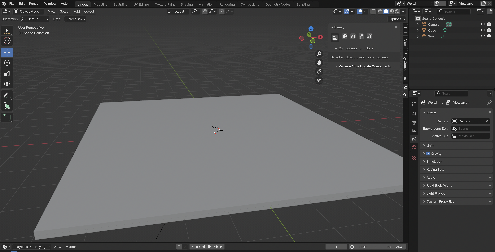
</details>

Now switch to the `Library` scene.
If you're coming from the [quickstart](../quickstart/readme.md) guide, you may now delete the `Player` collection by
right-clicking it in the outliner and selecting `Delete Hierarchy`.
Remember, you can find the outliner all the way to the right.

## Create a Rigid Body

Create a new collection with `rightclick` -> `New Collection` and name it `Direct`. This name will make sense in the next section.

Click on the `Direct` collection we just created to select it. Then, go to `Add` -> `Mesh` -> `Cube` in the upper left corner to add a cube to the collection. Leave it at the default transform.

Avian makes a distinction between a *rigid body* and its associated *colliders*.
In general, the best practice is to have a parent object be a rigid body and then have at least one descendant object be a collider.

Add the `RigidBody` as follows:

- select the collection named `Direct` in the outliner.
- go to the Blenvy menu's component manager. Remember, if are missing the side menu, you can open it with `N`.
- type `rigidbody` in the search bar
- select `avian3d::dynamics::rigid_body::RigidBody`
- add it

> [!TIP]
> If you do not see `avian3d::dynamics::rigid_body::RigidBody` in the list of components, make sure you have run a `cargo run` after the `PhysicsPlugins::default()` was added to your Bevy app as described above.
> If you still do not see the component, manually refresh the registry as described in the [quickstart section "Create a blueprint"](../quickstart/readme.md#create-a-blueprint).

The result should look like this:

<details>
<summary>A rigid body on the cube</summary>
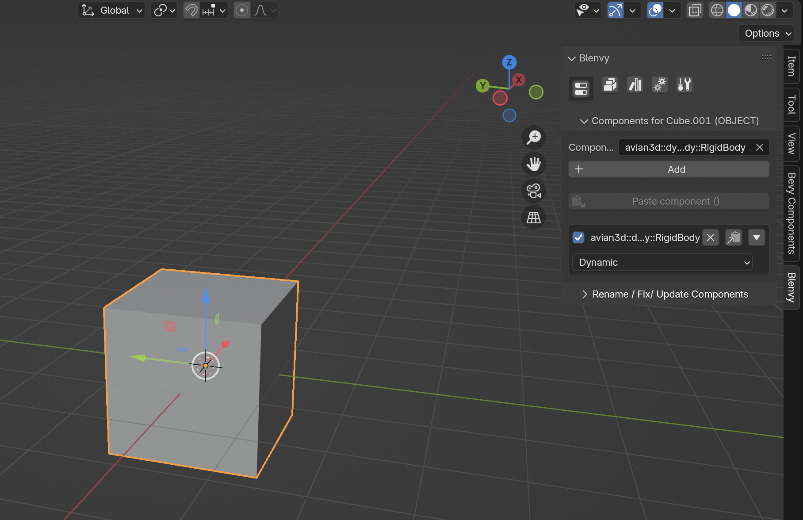
</details>

The default value for `RigidBody` is `Dynamic`, which is what we want for all three objects.
It means that they will be affected by gravity and other forces.

## Add Primitive Colliders

Colliders come in two flavors: primitive and dynamic. Primitives are made up of simple shapes like cubes, spheres, and cylinders. Dynamic colliders are created at runtime from the mesh of the object they are attached to. In general, it is *way* more efficient to use primitives and placing them manually. You may think that this is a lot of work, but usually you can get away with a very rough more or less boxy shape. We will show you how this approach first.

There are three different ways to add primitive colliders to the objects, in order of increasing complexity.

### Direct

Select the collection named `Direct` and search in the component manager for `colliderconstructor`.
Select `avian3d::collision::collider::constructor::ColliderConstructor` and add it.
By default, the collider will be of the variant `Sphere`. Change it to `Cuboid`.
Since the standard cube in Blender is of size 2 m, set the `x_length`, `y_length`, and `z_length` all to `2.0`:
<details>
<summary>A collider on the cube</summary>

</details>

That's already it.

> [!CAUTION]
> This method brings a major footgun: Blender uses Z-up coordinates, while Bevy uses Y-up coordinates.
> The information you enter into the `ColliderConstructor` is in Bevy's coordinate system, so don't mix them up!

To see it in action, we switch to the `World` scene and add and instance of our `Direct` collection with `Add` -> `Collection Instance`.

<details>
<summary>The world scene with the direct collider cube</summary>
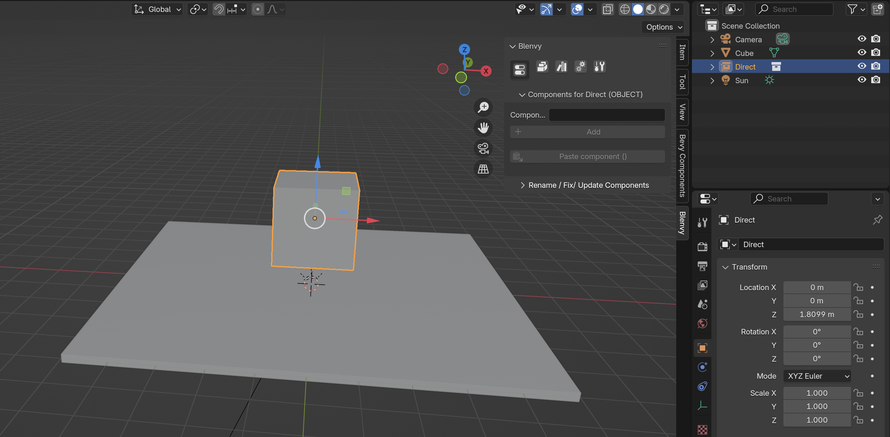
</details>

Save the scene to let Blenvy export everything and run the game with `cargo run`.

<details>
<summary>The cube falls down</summary>

</details>

If everything went right, your cube should fall into the void due to gravity.
Note that it phases right through the ground because we have not yet added a rigid body and collider to it yet.

Click on the ground object and add a `RigidBody` component as described before to it, but this time set it to `Static`.
This means that the ground itself will not react to forces such as gravity, but will still affect other rigid bodies.
Note that since we are not working with a blueprint here, you'll need to add the component to the object itself rather than a collection.

Also add a collider to the ground as before. Make sure that the dimensions of the collider match the dimensions of the ground.

<details>
<summary>Ground collider</summary>

</details>

> [!CAUTION]
> As mentioned before, when using this method you should be aware that the component
> is in Bevy's coordinate system, so set the `y_length` to the *height* of the ground.

Run your game again with `cargo run` to see the cube landing on the ground.

<details>
<summary>The cube falls onto the ground</summary>

</details>

> [!TIP]
> If your scene is doing something weird, try adding Avian's
> [`PhysicsDebugPlugin`](https://docs.rs/avian3d/latest/avian3d/debug_render/struct.PhysicsDebugPlugin.html)
> to your Bevy app to see the colliders at runtime.  
> If the collider looks flipped, try switching the Y and Z lengths.

### With Empty

You'll notice that the last variant does not actually show you a preview of the collider. Let's fix that.

Go back to the `Library` scene. Add a collection named `With Empty`.

> [!TIP]
> If you accidentally created a collection as a child of another, simply drag-and-drop them around to reorder them

Click on the `With Empty` collection to select it. Add a `RigidBody` to it as described before, but do not add a collider to it.
With the new collection selected, go to `Add` -> `Mesh` -> `Cube`. Name the new object `Board`.
This time, scale it until it looks like a flat board:

<details>
<summary>The board in Blender</summary>
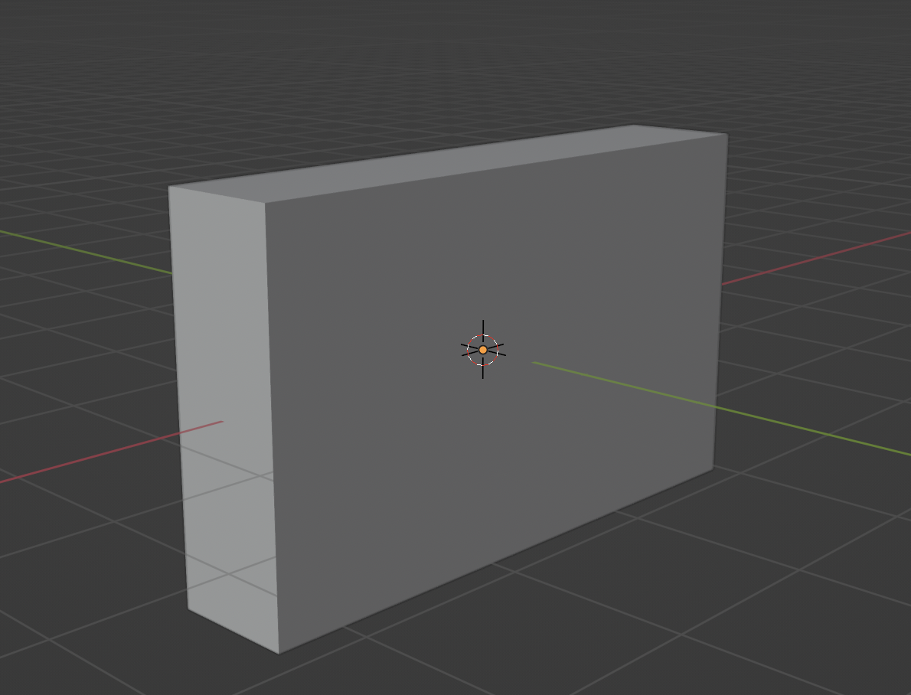
</details>

> [!TIP]
> The above screenshot was made after disabling the visibility of the `Direct` collection by clicking the eye icon in the outliner.
>
> <details>
> <summary>Hiding objects</summary>
> 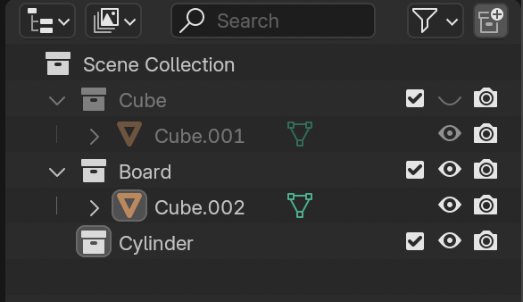
> </details>
>
> Hiding other collections becomes quickly essential when working with blueprints.

The scaling we used was the following:

- X: `2.5`
- Y: `0.5`
- Z: `1.5`

Now spawn an [*empty*](https://docs.blender.org/manual/en/latest/modeling/empties.html) with `Add` -> `Empty` -> `Cube`.
To make its properties a bit nice to work with, go to the `Data` tab of the `Properties` window in the lower right:

<details>
<summary>Where to find the data tab</summary>
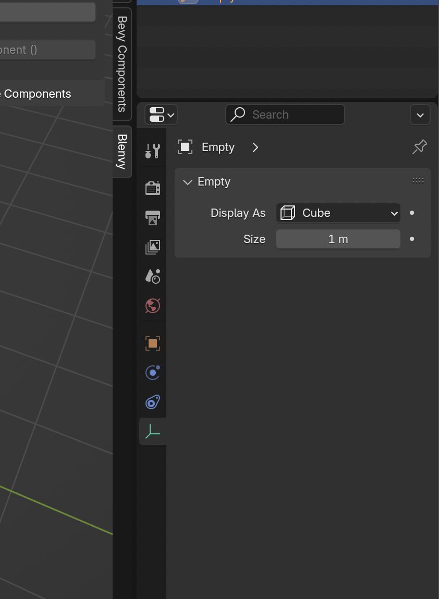
</details>

You'll notice that it says "Size: 1m". This is a little bit misleading, as we've seen before, since the default cube is actually 2x2x2. The "Size" actually refers to the half-extent of the cube. Set it to `0.5` to make the cube a nice 1x1x1 cube.

<details>
<summary>Where to find the data tab</summary>

</details>

Select the empty in the outliner and add collider to this empty like you did in the ["Direct" section](#direct).
Note that you are now adding the collider to the empty itself, not the overarching collection.

Set the cuboid collider's lengths to `1` this time.

If you have only the `Empty` set to visible and selected it, your viewport should now look as follows:

<details>
<summary>The empty with the right size and collider</summary>
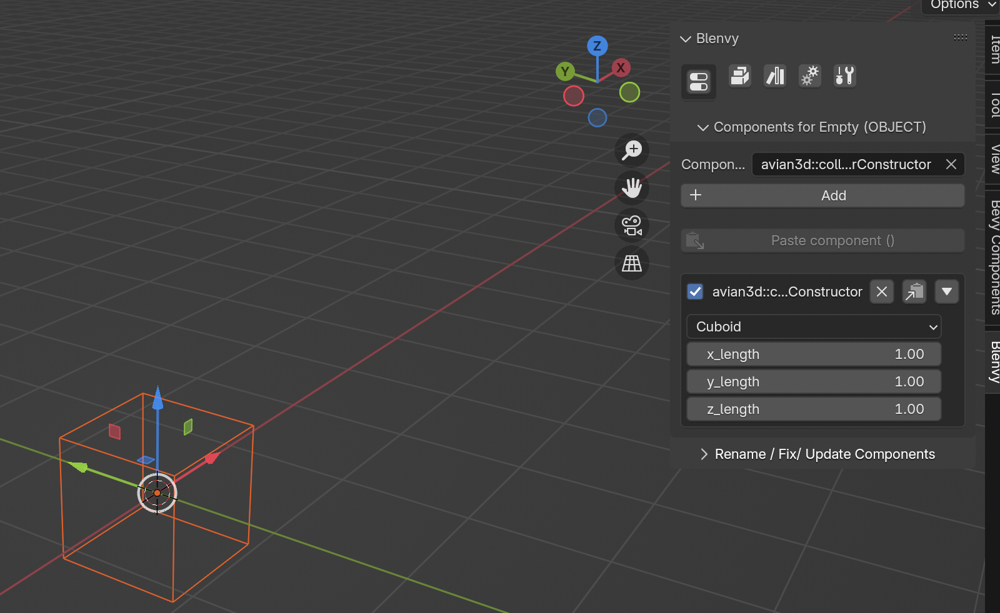
</details>

The important bit to realize here is that the empty's outlines perferctly match the attached collider's size.

Now, drag and drop the empty into the `With Empty` collection. With the empty selected, hold `CTRL` and select the `Board` object.

> [!IMPORTANT]  
> It is essential that you *first* select the `Empty` and *then* select the `Board`. The order is key!

With both objects selected, press `CTRL P` to bring up the parenting menu:

<details>
<summary>The screen after creating a new empty</summary>
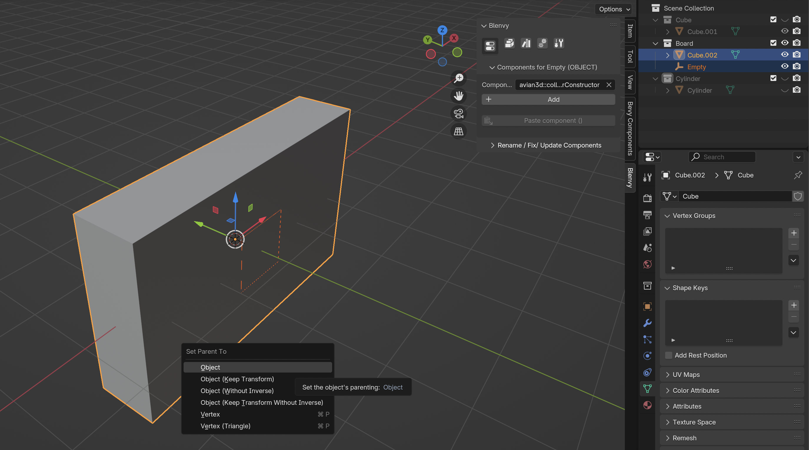
</details>

> [!NOTE]  
> Note how the color-coding in the screenshot above shows how `Board` has been selected last.
> Make sure this looks the same on your screen.

In the popup, select the first option, namely `Object`. If everything went right, you should be able to "fold open" the `Board` to find your `Empty` as a child in there:

<details>
<summary>The board is the parent of the empty</summary>
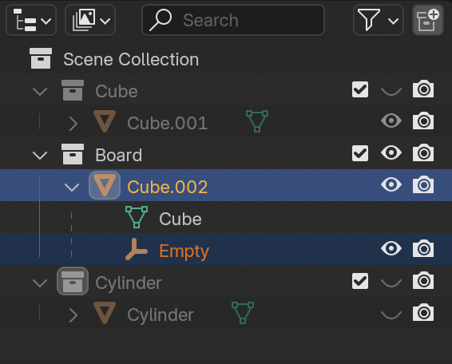
</details>

This hierarchy will exported to Bevy as well!

After this setup, we now have visible collider outlines that we can freely transform. Simply select the empty and transform it however you want. Whatever you do with this empty, the collider generated by Avian will look exactly like the outlines visible in Blender.

While you could (and sometimes should) scale this manually, there is a nice way of finding the right scale. Click on the `Board` object. Then, in the side menu, head to the `Item` tab. Check out the `Dimensions` reported there:

<details>
<summary>The dimensionality of the board</summary>
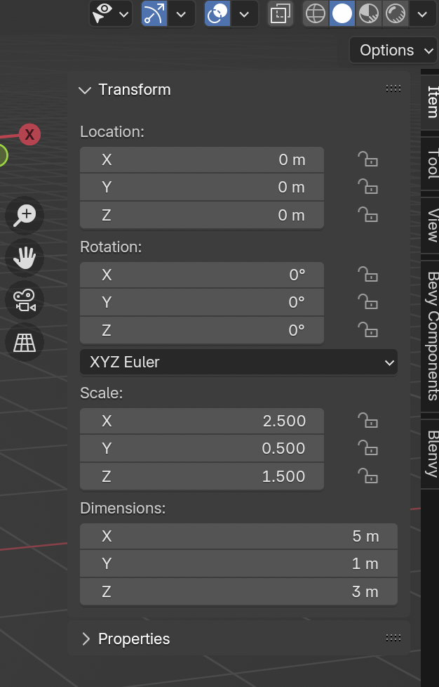
</details>

> [!TIP]
> If you are not seeing this screen, you have probably clicked on the `With Empty` collection, and not on the item within it.

As you can see, its dimensions are:

- X: `5`
- Y: `1`
- Z: `3`

You can just use these values as the scale for the `Empty`. After everything is done, your final object should look like this in the viewport, when only the `Board` and its children are visible:

<details>
<summary>Finished board</summary>
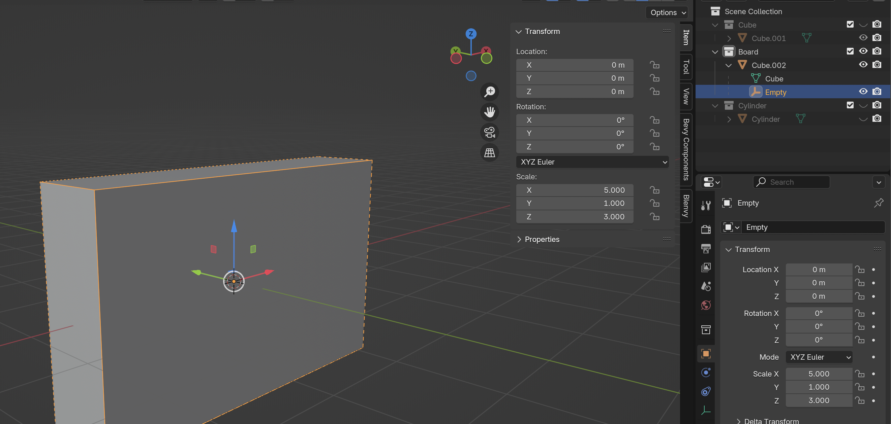
</details>

Note that the orange collider outlines should align nicely with the board's mesh.

Add an instance of the `With Empty` collection to the `World` scene just as before and run the game.
You should now see both objects fall to the ground.

<details>
<summary>The cube and board falling to the ground</summary>
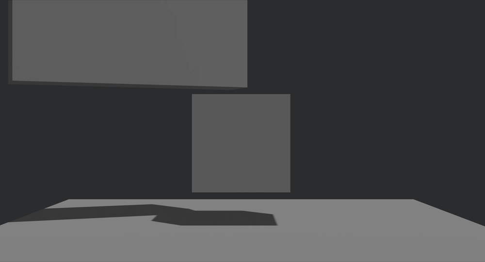
</details>

### Wireframes

Add a new collection named `Wireframe`. With it selected, add a `RigidBody` to it.
Then go to `Add` -> `Mesh` -> `Cylinder`. Leave it at the default transform.

The last variant is a bit of a workaround for the fact that empties in Blender cannot have an arbitrary shape.
For example, a cylinder is not supported. So, we are going to create a new cylinder preview by hand.
Click on `Add` -> `Mesh` -> `Cylinder`. Don't click away yet!
Right after you create an object in Blender, you can modify how it should be generated. In the lower left, you should see the following popup:

<details>
<summary>Post-creation popup</summary>
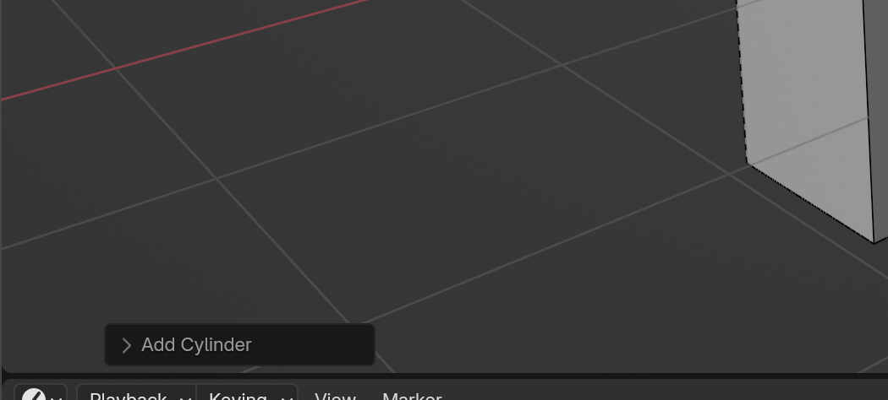
</details>

> [!NOTE]
> If you cannot see this popup, you cae changed Blender's focus after creating the object.
> You have to remove the cylinder and recreate it again.

Open up the popup to reveal a menu with some options for how to create a cylinder.
To again have a collider that nicely fits into a 1x1x1 space, set the `Radius` to `0.5` and the `Depth` to `1`.
To improve performance in Blender, you can also reduce the vertices, but this is not really important until you have hundreds of these colliders.

<details>
<summary>Settings for the cylinder</summary>
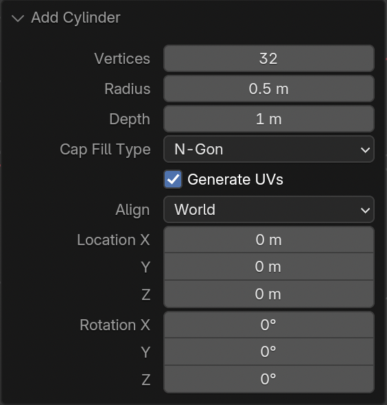
</details>

Hide everything except the newly created cylinder. Press `Tab` to enter the edit mode. Press `A` to select all vertices.
Press `X` to open the deletion menu. Select `Only Faces`. Press `Tab` again to go back into object mode.
You should now have the wireframe of a cylinder.

<details>
<summary>Wireframe</summary>
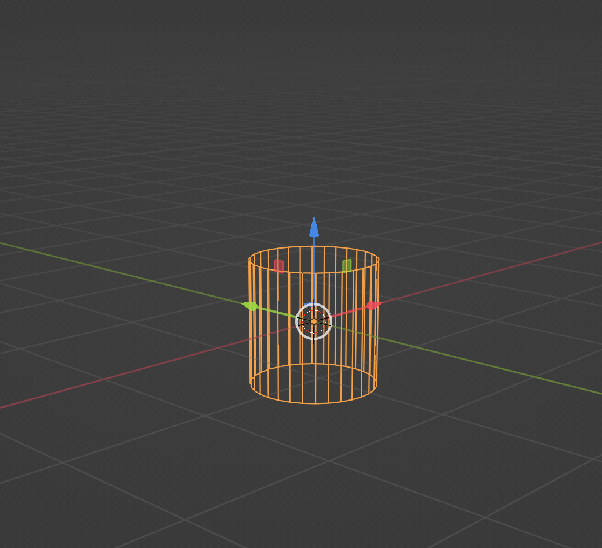
</details>

Now add a `ColliderConstructor` to it. This time, use the `Cylinder` variant. Set its `height` to `1` and `radius` to `0.5`, just as you did in the menu before.

<details>
<summary>Cylinder collider</summary>
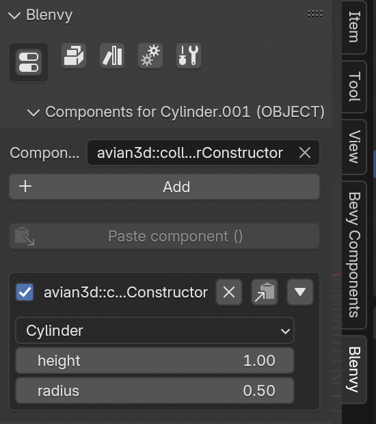
</details>

The rest of the steps are identical to the empty: Drag-and-drop the cylinder collider into the `Wireframe` collection, make it a child of your `Cylinder` object and scale it accordingly. The result should look like this:

<details>
<summary>Cylinder collider on mesh</summary>
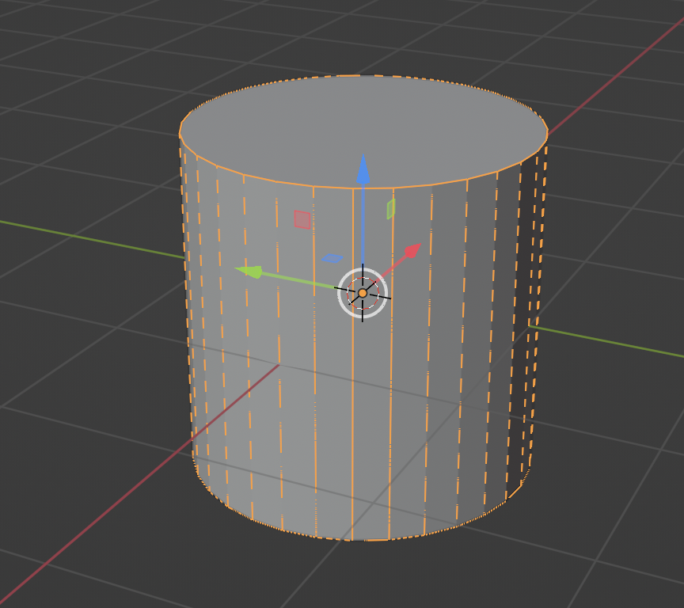
</details>

> [!TIP]
> Blender does not support creating all shapes that a collider would want.
> A notable omission is a capsule.
> You can use the builtin [Add Mesh Extra Objects](https://docs.blender.org/manual/en/latest/addons/add_mesh/mesh_extra_objects.html)
> extension to fill this gap.

Add an instance of the `Wireframe` collection to the `World` scene and run the game to see all kinds of primitive colliders tumble around.

<details>
<summary>Cylinder collider falling down</summary>
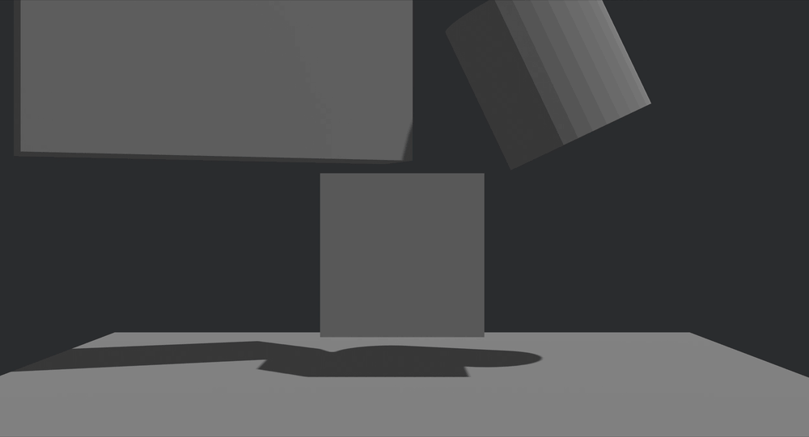
</details>

## Add Dynamic Colliders

Now let's go for some more complex shapes.
Remember, most of the time you'll want to approximate the shape with a primitive collider, but sometimes you need the exact shape
or just quickly want to test something. For this, we are going to use dynamic colliders.

### Convex

Go back to the `Library` scene, add a new collection, and name it `Convex`. Add a `RigidBody` to it.
Select `Add` -> `Mesh` -> `Torus`. Leave it at the default transform. Your scene should now look like this:

<details>
<summary>A simple torus</summary>
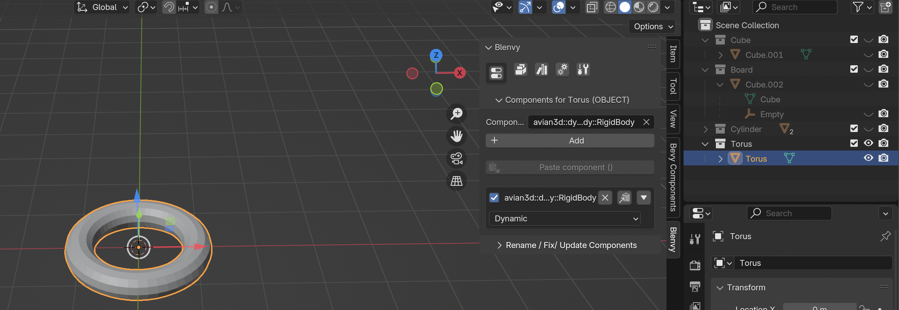
</details>

We will now dynamically generate a convex hull around this torus.
You can imagine the result like how it would look like if you tightly wrapped the torus up as a christmas present.
This means that the hole in the middle will be treated as solid, which is okay for our case.
When using dynamic colliders, try to prefer convex shapes, as they are much faster to calculate than concave shapes.

To use a dynamic collider, we must proceed a bit differently from before.
Instead of adding the component to the torus *object*, we add it to the *mesh*.
You can access it by expanding your object in the outliner. Its icon is a green triangle:

<details>
<summary>The selected mesh</summary>
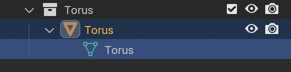
</details>

With the *mesh* selected, add a `ColliderConstructor` to it. Set the variant to `ConvexHullFromMesh`.
If you did everything correctly, the component manager should say "Components for Torus (MESH)" at the top:

<details>
<summary>The component manager for the torus mesh</summary>
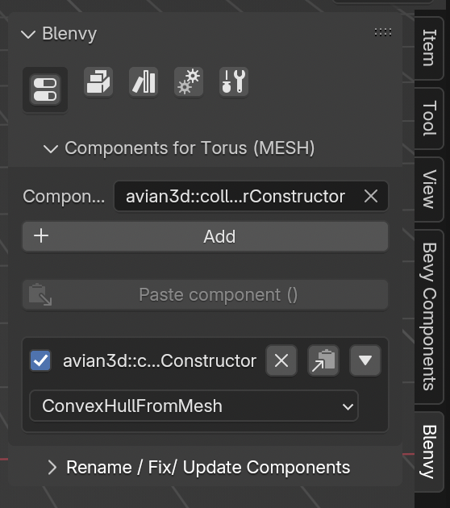
</details>

Go to the `World` scene and add an instance of the `Convex` collection. Save the scene, then run the game to see the torus fall down.

<details>
<summary>The convex collider falling</summary>
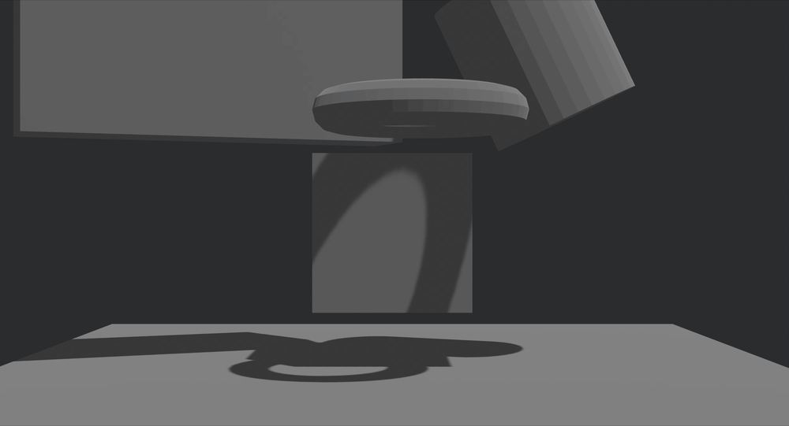
</details>

> [!TIP]
> Is your game crashing with `Tried to add a collider to entity Torus via ConvexHullFromMesh that requires a mesh, but no mesh handle was found`?
> That means you added your `ColliderConstructor` to the object instead of the mesh.
> Go back to the screenshots above and make sure you have the mesh selected when adding the component.

### Concave

Add a new collection and name it `Concave`. Add a `RigidBody` to it. Select `Add` -> `Mesh` -> `Monkey`.
Yes, Blender has a builtin method for creating Suzanne, its monkey mascot. Isn't it great?
Anyways, just as before, select the *mesh* of the monkey.
Add a `ColliderConstructor` to it. This time, set the variant to `TrimeshFromMesh`.

> [!CAUTION]
> While `TrimeshFromMesh` can deal with any kind of mesh, it is also the slowest collider to run.
> Additionally, the generated collider will always be treated as if it was hollow.
> That means that any objects that are completely inside the mesh will not collide with it.
> Only use a concave collider if you *really* need it.

Just as before, go to the `World` scene and add an instance of the `Concave` collection. Save the scene, then run the game to see the torus fall down.

<details>
<summary>The concave collider falling</summary>
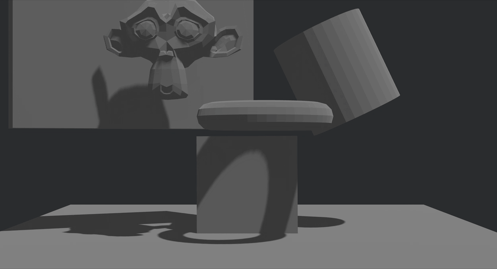
</details>

## Other useful components

The object holding the `ColliderConstructor` can hold some additional components that are useful for tweaking the physics behavior.

- `ColliderDensity` will set the density of the collider and indirectly change the rigid body's mass.
- `Sensor` allow other objects to pass through the collider. It will still report the collision to the physics system so you can react to it.
- `CollisionLayers` controls which other colliders this collider will interact with. Note that since this is a bitflag, manipulating it in Blender is a bit cumbersome. You probably want to set up some kind of `enum` that can be used in Blender and then add the proper `CollisionLayers` in Bevy.

This is just a small selection. Refer to the [Avian documentation](https://docs.rs/avian3d/latest/avian3d/) for more information.
