# Quickstart

This guide assumes you use Blender 4.2 or newer and have set it to English.

> [!NOTE]  
> This is not a Blender tutorial. No worries, we will make sure you find all necessary buttons to click, but we will not explain in detail what Blender concepts like "collections" or "scenes" are. If you are not familiar with Blender, you might want to look up some basic tutorials first.

## Table of Contents

- [Install the Blender Addon](#install-the-blender-addon)
- [Setup the Bevy side](#setup-the-bevy-side)
- [Setup the Blender addon for your project](#setup-the-blender-addon-for-your-project)
- [Create a blueprint](#create-a-blueprint)
- [Compose the world](#compose-the-world)
- [Run your game](#run-your-game)
- [Next Steps](#next-steps)

## Install the Blender Addon

- Download `blenvy.zip` from the [release page](https://github.com/kaosat-dev/Blenvy/releases/tag/blenvy_v0.1.0-alpha.1)
- Open Blender
- Drag and drop `blenvy.zip` into Blender
  - <details>
    <summary>This window should show up</summary>

    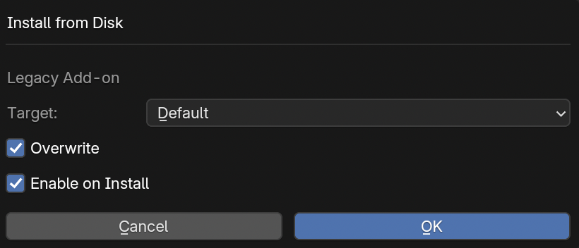
  
    </details>
- Leave all settings as is and click on `OK`

Leave the scene open, we will get back to it later.

## Setup the Bevy side

Run the following commands:

```sh
cargo new my_game
cd my_game
cargo add bevy
cargo add blenvy
```

This guide will tell you to `cargo run` at multiple points. We expect that you are still in the `my_game` directory when you do so.

Now, replace the contents of `src/main.rs` with the following:

<details>
<summary>src/main.rs</summary>

```rust
use bevy::prelude::*;
use blenvy::*;

fn main() -> AppExit {
    App::new()
        .add_plugins((DefaultPlugins, BlenvyPlugin::default()))
        // We need to register components to make them visible to Blenvy
        .register_type::<Player>()
        .add_systems(Startup, setup)
        .run()
}

#[derive(Component, Reflect)]
#[reflect(Component)]
struct Player {
    strength: f32,
    perception: f32,
    endurance: f32,
    charisma: f32,
    intelligence: f32,
    agility: f32,
    luck: f32,
}

fn setup(mut commands: Commands) {
    commands.spawn((
        BlueprintInfo::from_path("levels/World.glb"),
        SpawnBlueprint,
        HideUntilReady,
        GameWorldTag,
    ));
}
```

</details>

`Player` is the component that we will add to our entities in Blender. It can contain any fields you want, but you need to remember to call `register_type` with it.

Running this won't work yet because the `levels/World.glb` we reference doesn't exist yet. We will create it in the next step.

## Setup the Blender addon for your project

Create a directory under `my_game` called `art`. Hop back into Blender and save the default scene as `my_game.blend` in the `art` directory we just created. Your file structure should now look like this:

<details>
<summary>File structure</summary>

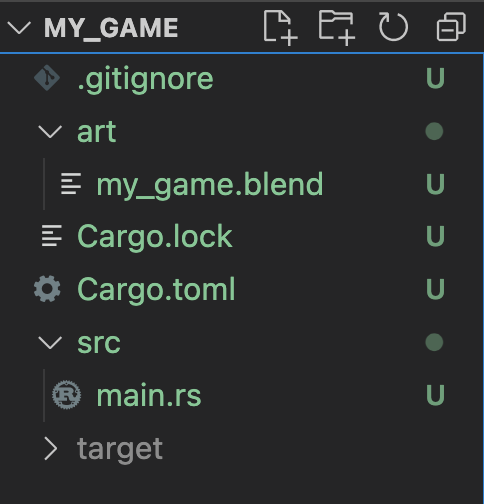
</details>

Now, clear the default scene of any objects or collections.
The fastest way to do this is to look for the collection named simply `Collection` all the way on the right of Blender. Right-click on it and select `Delete Hierachy`. For future reference, the place where you just did this is called the *outliner*.

> [!TIP]
> Technically, we could leave the default setup as-is since we are going to recreate it later anyway.
> However, we are starting from a clean slate in order to make it explicit what we are doing
> and which data is being exported to Bevy.

<details>
<summary>The default collection to delete</summary>

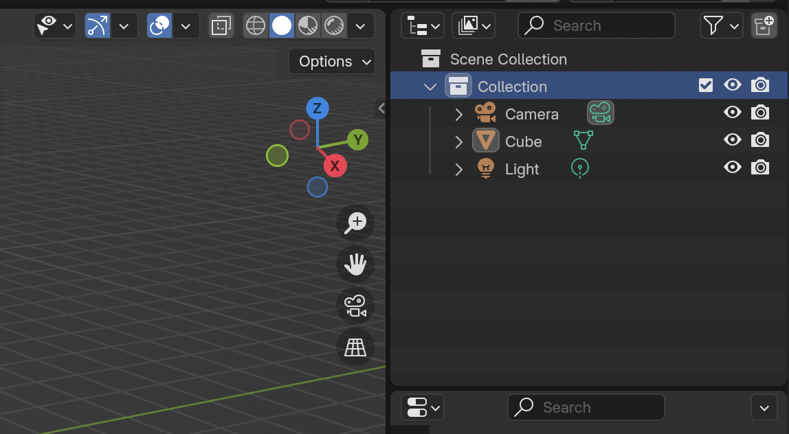
</details>

Rename the default scene from `Scene` to `World` by clicking on "Scene" in the upper right corner of Blender and typing a new name.

<details>
<summary>Where to rename the scene</summary>

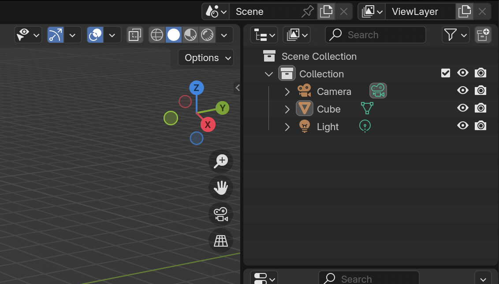
</details>

Next, create a new scene by clicking on the icon that looks a bit like two pages, next to where you just renamed the scene, and then selecting `New`. Rename this scene to `Library`.

<details>
<summary>Where to create a new scene</summary>

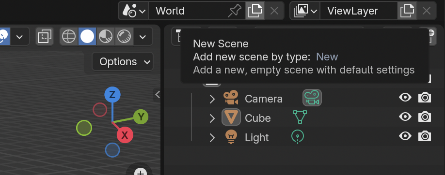
</details>

If everything went alright, entering the scene selector by pressing the icon next to the scene name should look like this:

<details>
<summary>Scene selector</summary>

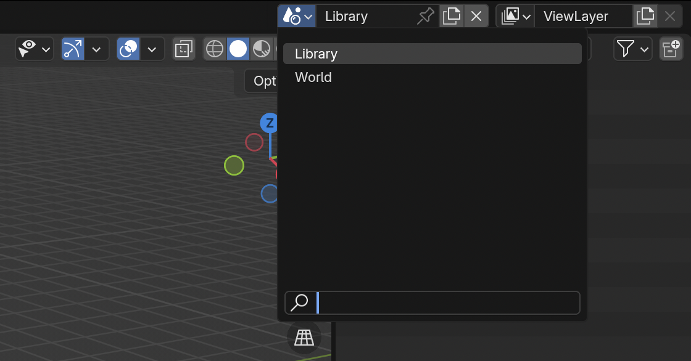
</details>

If you switched around scenes to see if everything worked, make sure to switch back to the `Library` scene now.

Press `N`. This will open a side window. In it, click on the tab `Blenvy`. This is the main window through which you will interact with Blenvy.

<details>
<summary>Blenvy menu</summary>
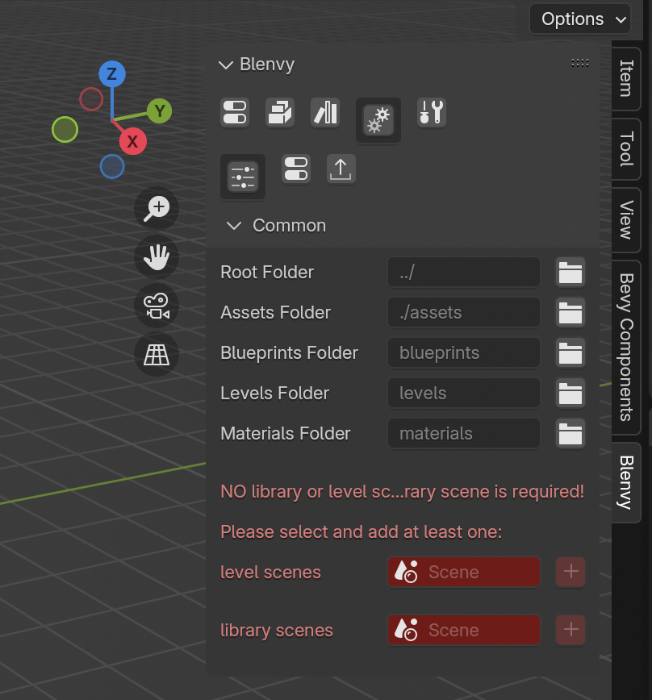
</details>

You will see that two options are highlighted red because they are not yet configured.

For `level scenes`, click on the selector, select `World` and hit `+`. For `library scenes`, select `Library` and again hit `+`.

Your menu should now look like this:

<details>
<summary>Correctly setup Blenvy</summary>
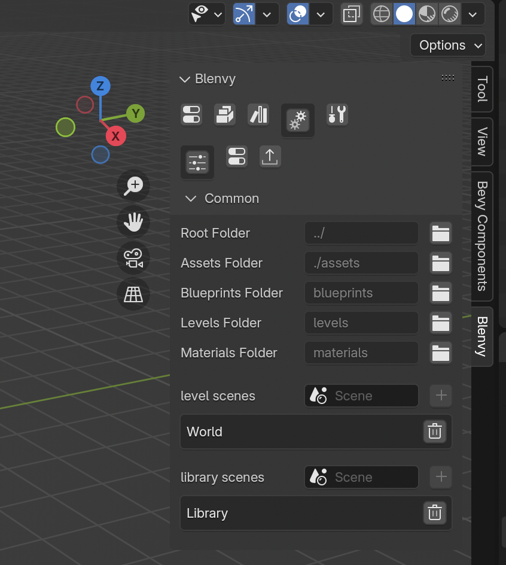
</details>

Save your Blender file by pressing `Ctrl + S` on Windows or Linux and `Cmd + S` on macOS. You should now have a new asset under `my_game/assets/levels/World.glb` and a companion file containing metadata.

<details>
<summary>The newly created level assets</summary>
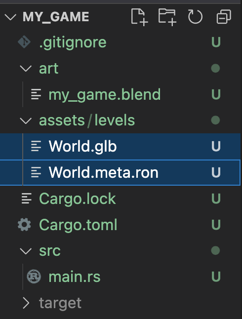
</details>

Now run your game with `cargo run`. It may crash because the scene is empty, but don't worry. The point is that now will have generated another new file, namely `assets/registry.json`. This file contains the information about all components exported by your game so that Blenvy can pso them in Blender.

<details>
<summary>The final file structure for an empty world</summary>
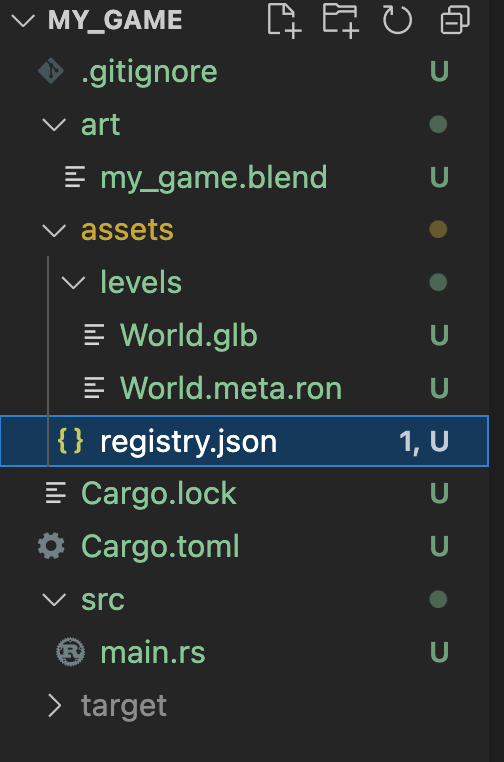
</details>

This concludes the setup portion of the guide.

## Create a blueprint

Alright, let's jump into the actual workflow you'll be using to create your game.
We will first create an object for the `Player` component we defined earlier.
While still in the `Library` scene, right-click on the `Scene Collection` in the outliner to the right. Select `New Collection`. Double-click on the new collection that appeared and rename it to `Player`. Click on it to have it selected.

<details>
<summary>The player collection</summary>
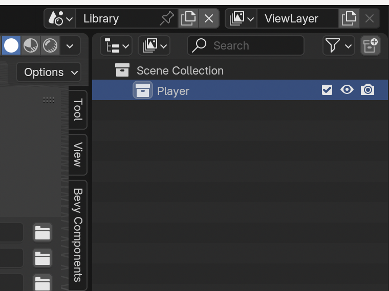
</details>

Now, on the upper left of Blender, click on `Add` -> `Mesh` -> `Cube`. This will be our player.
Select the `Player` collection again. We will now add the `Player` component to it.
Go to the Blenvy menu we opened earlier. Select the icon in its upper left corner. This is where components are managed.

<details>
<summary>The component manager</summary>
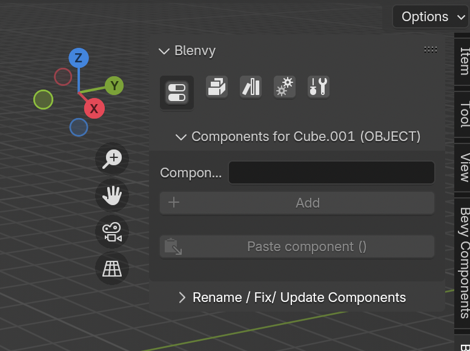
</details>

If your component manager says "Select an object to edit its components", make sure you have the `Player` collection we just created selected by clicking on it in the outliner.

Click on `Components`. If it says "No results found", we need to explicitly reload the registry. In the Blenvy menu, click on the gear icon (the fourth one from the left). In the submenu, click on the second icon. Your menu should now look like this:

<details>
<summary>The registry settings</summary>
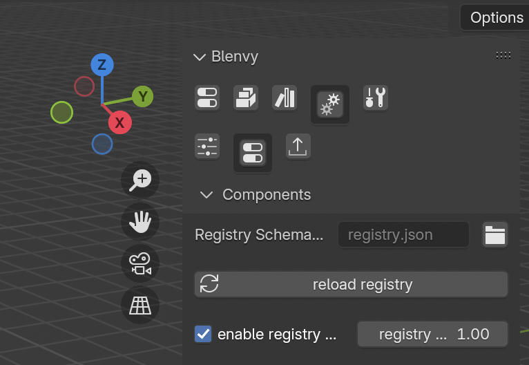
</details>

Click on `reload registry` to reload it manually.
Go back to the component manager and you should now be greeted by a whole bunch of components:

<details>
<summary>The registry settings</summary>
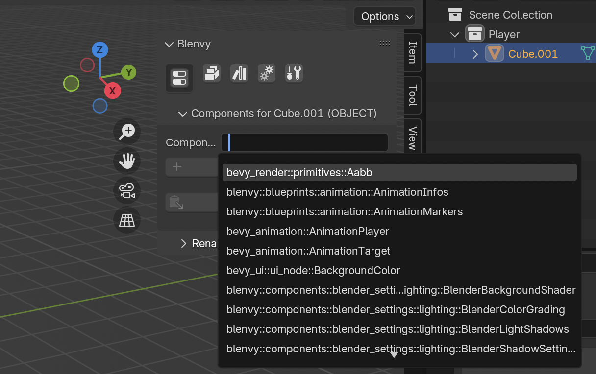
</details>

Type in `Player` and click on `my_game::Player`.

> [!TIP]
> If this does not show up, you have forgotten to call `register_type` with it.

Now click `Add`. You can now set all the player's fields in a neat Blender UI. Note that while we are only using `f32` here, you can use any kind of field, even complicated nested enums or structs.

<details>
<summary>The player component in Blender</summary>
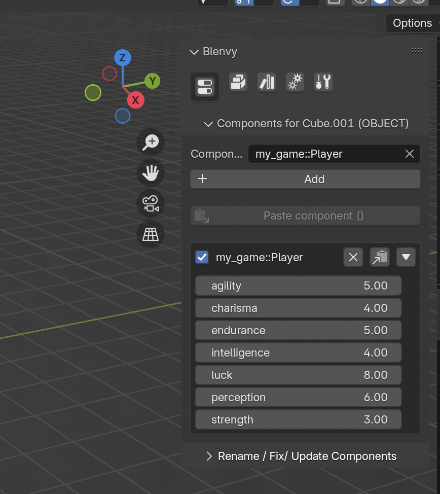
</details>

Congratulations, you have just created your first blueprint.

## Compose the world

Let's populate our world now. Switch back to the `World` scene in Blender as described before.

We will add the following kinds of objects to our world:

- Some basic ground, which we will create directly in the world
- A camera
- A light
- The player character, which will be a blueprint instance

First, let's add a camera through `Add` -> `Camera`. Blender will make the camera face whatever direction the viewport is aimed at, which will probably be completely arbitrary.
Move the camera a bit so that it faces the world origin and is rotated the right way.
Pressing `0` on your numpad will show you a preview of what the camera sees.
You can just copy our transform if you like:

- Location:
  - X: `0`
  - Y: `-10`
  - Z: `2`
- Rotation
  - X: `80`
  - Y: `0`
  - Z: `0`
- Scale
  - X: `1`
  - Y: `1`
  - Z: `1`

  All transforms we are using assume that you are using the `XYZ Euler` mode for rotation.

<details>
<summary>The camera transform in Blender</summary>
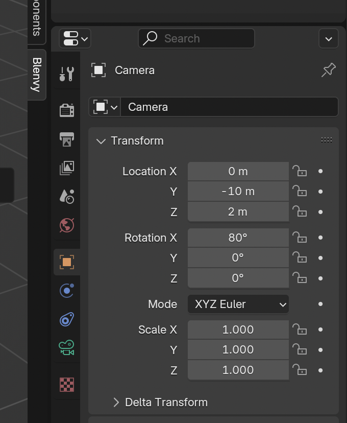
</details>

Now, let's add a ground with `Add` -> `Mesh` -> `Cube`. Again scale and move it so that it lies neatly under the camera. Our transform looks like this:

- Location:
  - X: `0`
  - Y: `0`
  - Z: `0`
- Rotation
  - X: `0`
  - Y: `0`
  - Z: `0`
- Scale
  - X: `5`
  - Y: `5`
  - Z: `0.1`

Add a directional light with `Add` -> `Light` -> `Sun`.
This light's position and scale do not matter, only its rotation is actually used. We are using the following:

- Rotation
  - X: `20`
  - Y: `20`
  - Z: `0`

Finally, it is time to create an instance of our player blueprint! For this, go to `Add` -> `Collection Instance` and select `Player`. It will spawn at origin, which means directly inside the ground for us. Move it a bit up. A location of `Z: 1.1` should placed it just a tiny bit above the ground.

And with that, our Blender scene is finished! The final result should look like this:

<details>
<summary>The final Blender world scene</summary>
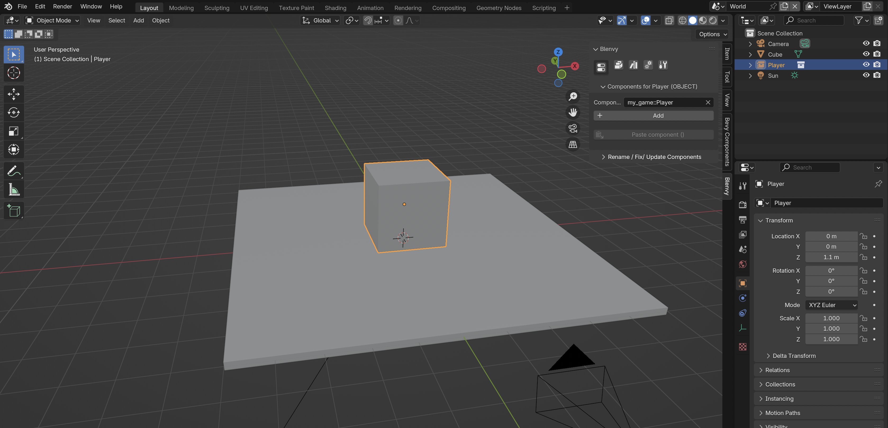
</details>

Save your Blender file again. This will update the `World.glb` file in the `assets` directory and create a new file for our player blueprint under `assets/blueprints/Player.glb`, including again a metadata file.

<details>
<summary>The new blueprint files</summary>
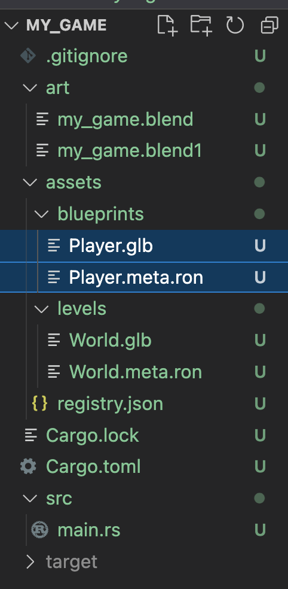
</details>

## Run your game

Congrats, you're done! Just run your game with `cargo run` and you should see your world in all its glory:

<details>
<summary>The final Bevy render</summary>
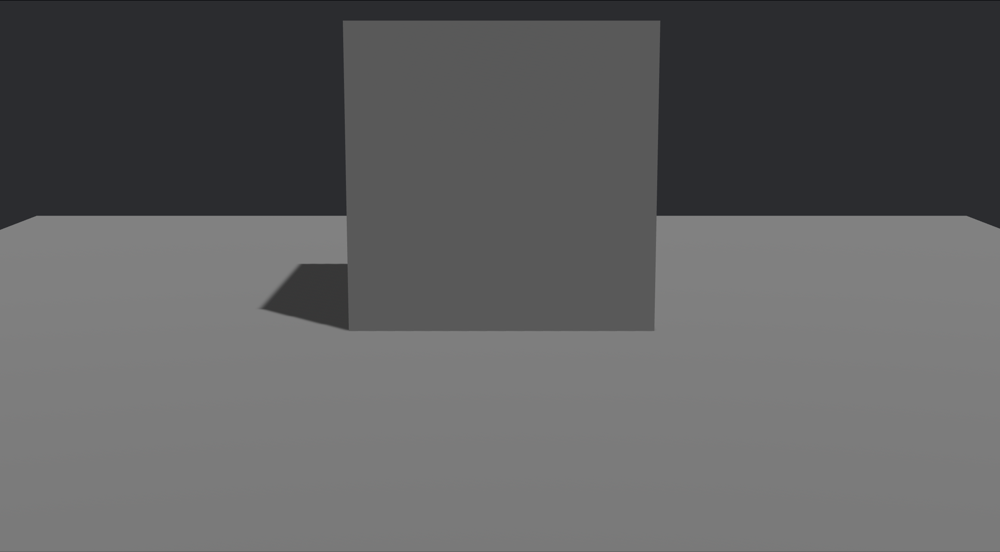
</details>

Okay, maybe not that much glory. But the important part is that the player is visible in the scene and has a `Player` component on it. You can now add more components to the player, create more blueprints, and populate your world with them. They can have animations, materials, etc. Have fun!

## Next Steps

- Read the [Blenvy for Bevy](../../crates/blenvy/README.md) documentation for more features on the Bevy side.
- Read the [Blenvy for Blender](../../tools/blenvy/README.md) documentation for more features on the Blender side.
- Read about the [Avian Physics Integration](../avian/README.md) to learn how to setup colliders in Blender that will be used by the Avian physics engine in Bevy.
