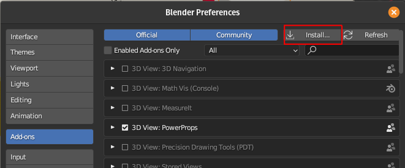
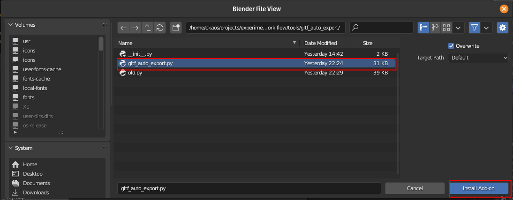
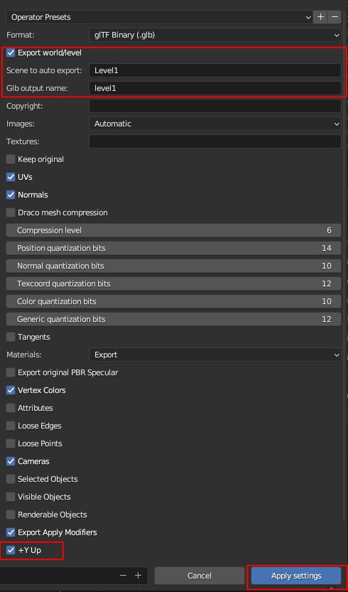

# gltf_auto_export

For convenience I also added this [Blender addon](./gltf_auto_export.py) that automatically exports your level/world from Blender to gltf whenever you save your Blend file
(actually when you save inside your level/world scene or in the "library" scene, where I personally usually store all collections to instanciate).
It is **very** barebones and messy, but it does a minimal ok job.

### Installation: 

* in Blender go to edit =>  preferences => install



* choose the path where ```blender_auto_export/gltf_auto_export.py``` is stored



### Usage: 

* before it can automatically save to gltf, you need to configure it
* go to file => export => gltf auto export


* set up your parameters: output path, name of your main scene etc

    

* click on "apply settings"
* now next time you save your blend file you will get an automatically exported gltf file


### TODO:
- [ ] add option for toggling collection replacement logic
- [ ] add categories/dropdowns in ui