# Components

## Configuration

The second tab in the settings contains the component settings:

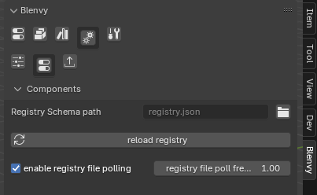


> you normally do not need to do anything, as the defaults are already pre-set to match those on the Bevy side for the location of the ```registry.json``` file, unless you want to store it somewhere other than ```assets/registry.json```

###### registry file (default: assets/registry.json)

- click on the button to select your registry.json file (in the "configuration" panel)

###### reload registry

- click on the button to force refresh the list of components from the registry.json file


##### registry file polling

* by default, the add-on will check for changes in your registry file every second, and refresh the UI accordingly
* you can set the polling frequency or turn it off if you do not want auto-refresh


## Supported components

- normally (minus any bugs, please report those!) all components using **registered** types should be useable and editable
- this includes (non exhaustive list):
  * enums (even complex ones !)  
  * complex structs, with various types of fields (including nested ones)
  * lists/ vecs
  * hashmaps
  * etc !

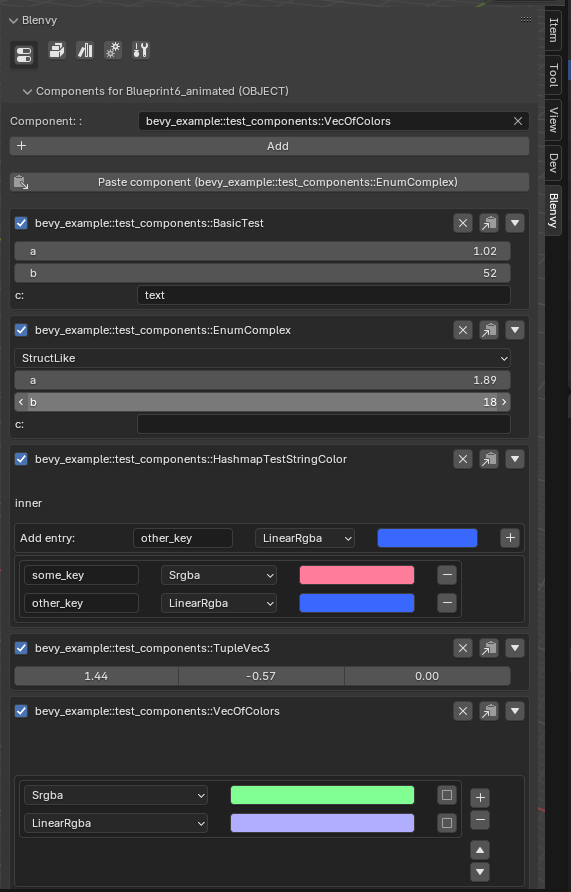

## Supported items for components

you can add components to 
  - objects 
  - collections/ blueprints
  - meshes
  - materials

These will be all applied correctly to the resulting entities on the Bevy side

### Blueprints & components:

- to add components to a blueprint, select your blueprint's collection and add the desired component

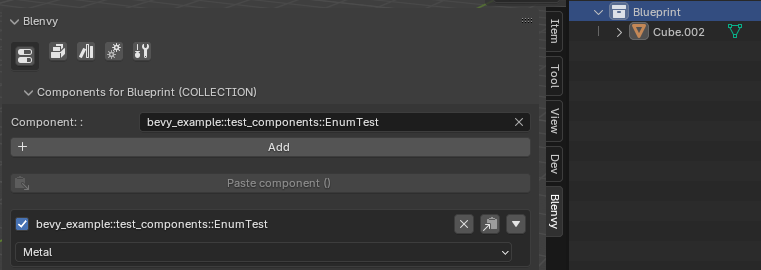

- when you select a blueprint/collection **instance** you can view both the **blueprint** level components (for all instances) ...

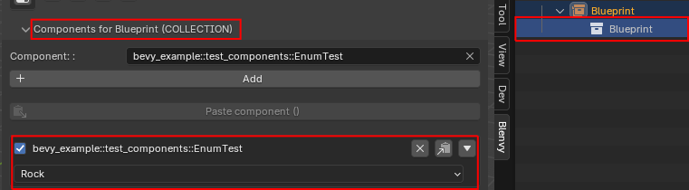


- and the components specific to that **instance**

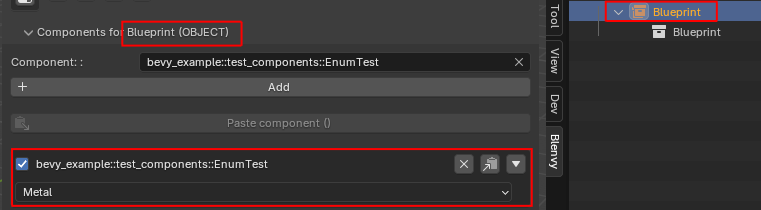


> if the instance and blueprint have the same component, the component value of the **instance** takes precedence & overwrites that of the blueprint ! In the case above, the component will have the value ```Metal``` for that instance.

## adding components

- to add a component, select any object, collection, mesh or material and then select the component from the components list: (the full type information will be displayed as tooltip)

- click on the dropdown to get the full list of available components

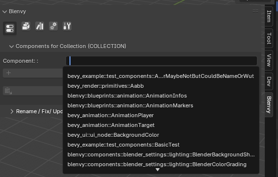

- the list of components is searchable !

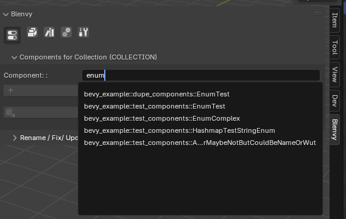

- add a component by clicking on the "add component" button once you have selected your desired component

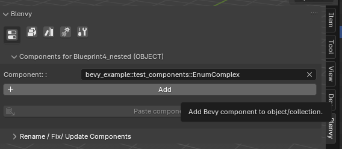

  it will appear in the component list for that object

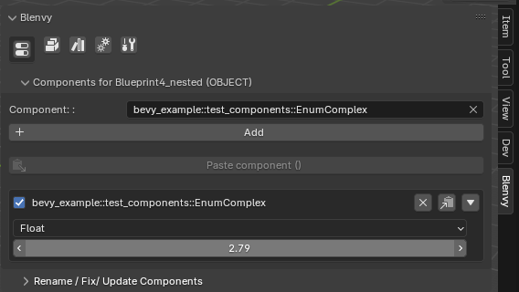


## editing components

- to edit a component's value just use the UI: 

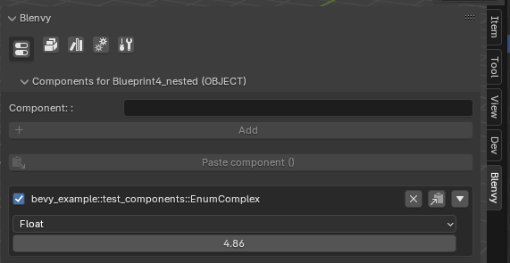


## copy & pasting 

- you can also copy & paste components between objects/collections/meshes/materials

- click on the "copy component button" of the component you want to copy

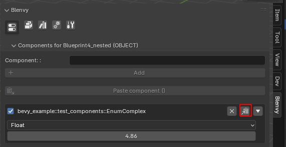

- then select the item you want to copy the component (& its value) to, and click on the paste button.

It will add the component to the select item

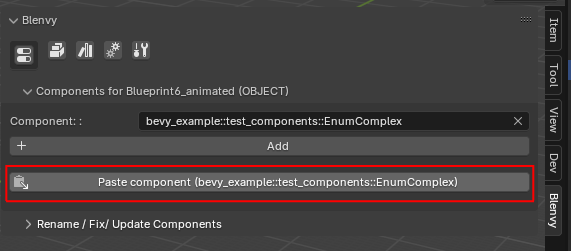

> if the target item already has the same component, its values will be overwritten


## Toggling component details

- for large/ complex components you can toggle the details of that component:

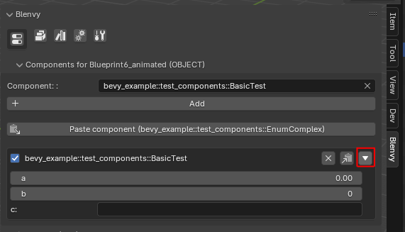


## Error handling & unregistered types

- if you have a component made up of unregistered structs/enums etc, you will get visual feedback & the component will be deactivated

    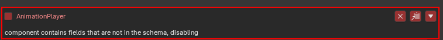

  > see [here](#renamingupgradingfixing-components) for ways to convert invalid / unregistered components to other types.


- if you are encountering this type of view: don't panic your component data is not gone ! It just means you need to reload the registry data by clicking on the relevant button

    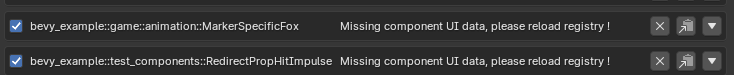

- non registered types can be viewed in this panel : (can be practical to see if you have any missing registrations too!)

    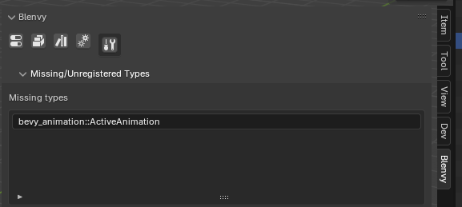


## Renaming/upgrading/fixing components

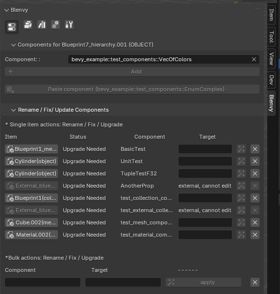

### Single item actions

this panel shows you the list of components that either 
 * are not in the registry anymore
 * are invalid (there is some error in the component that makes it unavailable in Blenvy)
 * need upgrading (ie they where stored as a custom property instead of Blenvy metadata for example)

> The last case is also for components that where created before Blenvy , using the legacy **bevy_components** Blender add-on

> The objects & components in this panel are not related to your current selection

- select the target component for a given source item/component:

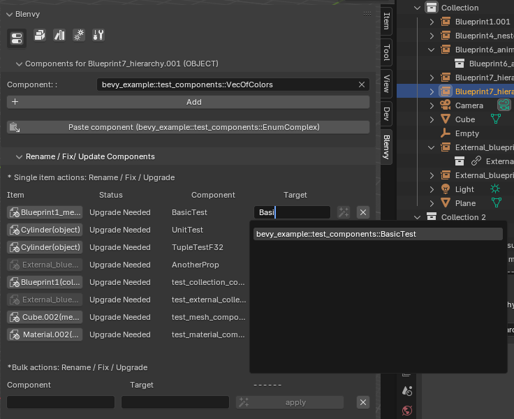

- click on the apply button

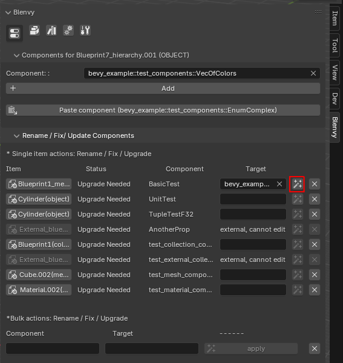

- you will get a notification depending on how the process went, and if all went well, the entry will be deleted from the list of items that need fixing/upgrades

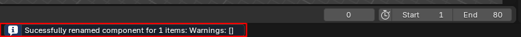


### Bulk actions:

- you can rename/convert/upgrade or delete a given type of component to another for ALL of your objects, collections, meshes and materials in one go
by choosing an original and a target component & clicking on apply or delete


## Known issues & limitations:

* **Range** data (ie ```Range<f32>``` etc) are not handled at this time
* **Entity** structs are always set to 0 (setting entity values on the Blender side at this time does not make much sense anyway) 


## Technical details

- Blenvy's component system uses the data from the exported **type registry** in the registry.json file to add **metadata** to objects/collection/meshes/etc containing information about what components it uses + some extra information
- uses Blender's **PropertyGroups** to generate custom UIs & connects those groups with the custom properties so that no matter the complexity
of your Bevy components you get a nicely packed custom_property
- in order to avoid name clashes, it uses the full paths of components & stores the data in the ```bevy_components``` custom property
- changing the values of a component in the UI  will automatically update the value of the underlying entry in the ```bevy_components``` custom property
- different item types in Blender result in different types of GltfExtra components in Bevy (this all happens under the hood):
  - objects : GltfExtras
  - collections/ blueprints: SceneGltfExtras (as the Blueprints get exported as seperate scenes)
  - meshes: MeshGltfExtras
  - materials: MaterialGltfExtras
