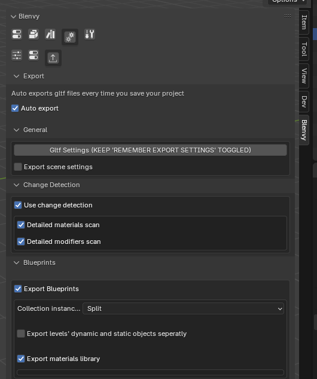
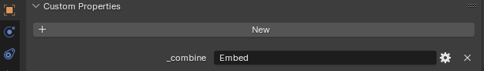
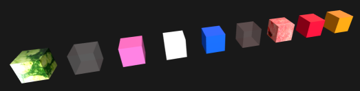
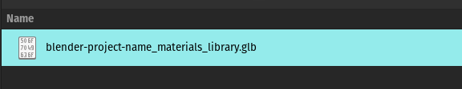

# Export

## Configuration

Settings are available in the export/ auto-export settings tab

### Auto export (default: True)

- toggle this to turn the whole auto-export system on or off : 
 when enabled, **every time you save your blend file** Blenvy will automatically export a set of gltf files , for levels, blueprints, materials etc depending on your settings, see below.

### Gltf settings

- click on this button to open Blender's standard gltf exporter settings **specific to Blenvy** : ie you have access to all of the normal gltf settings, but there is additional boilerplate
to gather these settings for Blenvy only, so it does not impact your normal export settings
- you *must* keep the "remember export settings" checkbox checked in order for the settings to be useable by Blenvy

> Important ! Do not use Blender's default gltf exporter (under file => export => gltf), as it does not impact Blenvy's settings

### Export scene settings (default: True)

- toggle this to export additional settings like ambient color, bloom, ao, etc from Blender to Bevy: this automatically generates additional components at the scene level that get processed by the Blenvy crate

### Use change detection (default: True)

- toggle this to enable change detection: ie, to make sure that only the blueprints , levels or materials that have actually **changed since your last save** get exported to gltf files, a sort of "incremental export".

> Under the hood, Blenvy serializes your whole Blender project to a simplified representation, to be able to tell the differents between successive changes

### Detailed materials scan (default: True)

- this options enables more detailed materials scanning & thus detecting smaller changes, even **changes in material nodes** . This comes at a potential additional processing cost, so if you notice performance issues in projects with complex materials
you can turn this off

### Detailed modifiers scan (default: True)

- similar to the one above but for modifiers, this options enables more finer grained change detection in modifiers, even **changes in geometry nodes** . This comes at a potential additional processing cost, so if you notice performance issues in projects with complex modifiers
you can turn this off

### Export blueprints (default: True)

- check this if you want to automatically export blueprints 

### Collection instances (default: split)

select which option you want to use to deal with collection instances (aka combine mode) (both inside blueprint collections & main collections)

  * split (default, highly recomended) : the addon will 'split out' any nested collections/ blueprints & export them
  * embed: choose this option if you want to keep everything inside a gltf file (less efficient, not recomended)
  * embedExternal: this will embed ONLY collection instances whose collections have not been found inside the current blend file

  These options can also be **overridden** on a per collection instance basis: (if you want to split out most collection instances, but keep a few specific ones embeded
  inside your gltf file)
      
   

  - simply add a custom property called **_combine** to the collection instance, and set it to one of the options above

### Export dynamic and static objects seperatly (default: False)
 

For levels scenes only, toggle this to generate 2 files per level: 

  - one with all dynamic data: collections or instances marked as dynamic (aka saveable)
  - one with all static data: anything else that is NOT marked as dynamic, the file name will have the suffix **_dynamic**

  Ie if you add a **Dynamic** custom/ component to either your collection instances or your blueprint, you get a clean seperation between 

  - your static level data (anything that will never change during the lifetime of your Bevy app)
  - your dynamic objects (anything that will change during the lifetime of your Bevy app, that can be saved & reloaded in save files for example)

### export materials library (default: True)

check this if you want to automatically export material libraries 
please read the dedicated [section](./README-export.md#materials) below for more information

### Additional export settings

- you can also force per level or per blueprint systematic export (regardless of change detection), see the relevant sections in the levels & blueprint documentation

## Materials

You can enable this option to automatically generate a **material library** files that combines all the materials in use in your blueprints.

Since each blueprint is normally a completely independant gltf file, without this option, if you have a material with a large texture for example, 
**ALL** of your blueprints using that material will embed that large texture, leading to **significant bloat & memory use**.

- When this option is enabled, you get a single material library per Blender project, and a **MaterialInfo** component is inserted into each object using a material.
- The correct material will then be inserted on the Bevy side (that loads any number of material libraries that you need) into the correct mesh
- Only one material per object is supported at this stage, ie the last material slot's material is the one that is going to be used

TLDR: Use this option to make sure that each blueprint file does not contain a copy of the same materials 

## Technical details

### Internal process (simplified)

This is the internal logic of the export process with blueprints (simplified)

ie this is an example scene...

and what actually gets exported for the level scene/world/level

all collections instances replaced with empties, and all those collections exported to gltf files as seen above