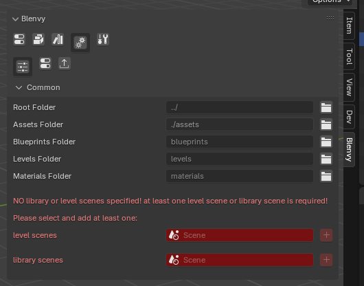
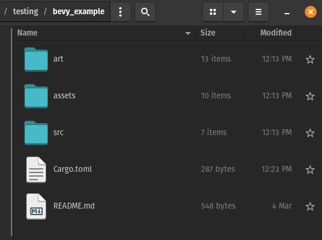
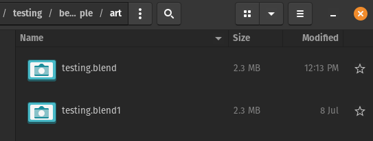
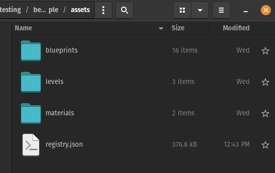

# Blenvy: Blender add-on


This [Blender addon](https://github.com/kaosat-dev/Blenvy/tree/main/tools/blenvy) gives you:
- an easy to use UI to add and configure your [Bevy](https://bevyengine.org/) components inside Blender 
    - the UI is **automatically generated** based on a **registry schema** file, an export of all your **registered** Bevy components's information, generated
by the registry export part of the [Blenvy](https://crates.io/crates/blenvy) crate
    - the ability to **toggle components** on/off without having to remove the component from the object
- an easy way to create blueprints/prefabs (just collections !) & levels 
- a way to setup you assets for your levels & blueprints
- an automatic export of your level/world from Blender to gltf whenever you save your Blend file.
    - export of used /marked collections as [Gltf blueprints](../../crates/blenvy/README.md)
    - change detection, so that only the levels & blueprints you have changed get exported when you save your blend file
    - export of material librairies

> IMPORTANT !! if you have previously used the "old" add-ons (*gltf_auto_export* & *bevy_components*), please see the [migration guide](../../Migration_guide.md)
If you can I would generally recommend starting fresh, but a lot of effort has been put to make transitioning easier


## Installation: 


* grab the latest release zip file


* up to Blender 4.1 go to edit => preferences => add-ons, click on install and choose the path where ```blenvy.zip``` is stored

  

* for Blender 4.2 , just drag & drop the zip file onto Blender to start the installation process


## Quickstart

* create your Bevy project
* setup the Blenvy crate
* create a Blender project
* set your level & library scenes (the **only** things that are not pre-configured)



* create your blueprints & levels
* add components (remember to configure the Bevy side first )
* save your blend file at any point , the rest is done automatically (export of levels & blueprints, etc)


## Configuration:

### Bevy side

 - setup the [Blenvy crate](https://crates.io/crates/blenvy) for your project (see the crate's documentation for that), and compile/run it to get the ```registry.json``` file to enable adding/editing your components in Blender

### Blender side


> The add-on comes almost completely pre-configured with sensible defaults, but you can set the following settings to your liking

#### Common

The first tab (and the one that is open by default in a new project) contains the common settings:


you **need** to tell Blenvy 

  - what your level scenes are (what Blender scenes should become levels in Bevy) 
  - what your library scenes are (what Blender scenes will store your library of re-useable blueprints) 

Blenvy is opinionated ! 

  - keep you art/sources (usually not delivered with your game) seperate from your game assets
  - keep your blueprints/levels/materials gltf files seperate

##### Root Folder (default: ../)

- this is the same folder as your Bevy projects main folder: the path here is relative to the current .blend file

##### Assets Folder (default: ./assets)

- a path, relative to the *root* folder above, where you want to store your assets (delivered with your game)

##### Blueprints Folder (default: blueprints)

- a path, relative to the *assets* folder above, where you want to store your *blueprints*

##### Levels Folder (default: levels)

- a path, relative to the *assets* folder above, where you want to store your *levels*

##### Materials Folder (default: materials)

- a path, relative to the *assets* folder above, where you want to store your *materials*

##### Level scenes

  -  what are the scenes in your .blend file that are levels/worlds

##### library scenes

  - library scenes: what are the scenes in your .blend file that contain your libraries of blueprints (that you then use in your levels)


#### Recomended folder structure








##### Components & export settings:

- for components please see [here](./README-components.md#configuration)
- for export please see [here](./README-export.md#configuration)


### Multiple blend file workflow

If you want to use multiple blend files (recomended if your project starts to grow even a bit), use Blender's asset library etc, we got you coverred too !
There are only a few things to keep in mind 

#### Assets/library/blueprints files
- mark your library scenes as specified above, but **do NOT** specify a **level** scene
- mark any collection in your scenes as "assets"
- choose "split" for the combine mode (as you want your gltf blueprints to be saved for external use)
- do your Blender things as normal
- anytime you save your file, it will automatically export any relevant collections/blueprints
- (optional) activate the **material library** option, so you only have one set of material per asset library (recomended)

#### Level/world files
- mark your level scenes as specified above ( personally I recommended **NOT** specifying a **library** scene in this case to keep things tidy, but that is up to you)
- configure your asset libraries as you would usually do, I recomend using the "link" mode so that any changes to asset files are reflected correctly
- drag & drop any assets from the blueprints library (as you would normally do in Blender as well)
- choose "split" for the combine mode (as you want your gltf blueprints to be external usually & use the gltf files generated from your assets library)
- do your Blender things as normal
- anytime you save your file, it will automatically export your level(s)

Take a look at the [relevant](../../examples/demo/) example for more [details](../../examples/demo/art/) 


## Useage

### Components

- for a detailed overview on how to add, edit, remove etc components please see [here](./README-components.md)

### Export

- for a detailed overview on auto exporting gltf files please see [here](./README-export.md)

### Levels

- for a detailed overview of blueprints please see [here](./README-levels.md)

### Blueprints

- for a detailed overview of blueprints please see [here](./README-blueprints.md)

> [!TIP]
> you can right click on a Blueprint instance in your level scenes or press SHIFT  + F to edit a Blueprint in a seperate temprary scene !
> you can right click or press SHIFT + F to create a new empty Blueprint and an instance of it from your main scenes
> right click again & select the option to stop editing it, or 

## Development 

- I highly recomend (if you are using vscode like me) to use 
[this](https://marketplace.visualstudio.com/items?itemName=JacquesLucke.blender-development) excellent extension , works easilly and fast , even for the latest 
versions of Blender (v4.0 as of this writing)
- this [article](https://polynook.com/learn/set-up-blender-addon-development-environment-in-windows) might also help out 
(easy enough to get it working on linux too)

## License

This tool, all its code, contents & assets is Dual-licensed under either of

- Apache License, Version 2.0, ([LICENSE-APACHE](../LICENSE_APACHE.md) or https://www.apache.org/licenses/LICENSE-2.0)
- MIT license ([LICENSE-MIT](../LICENSE_MIT.md) or https://opensource.org/licenses/MIT)