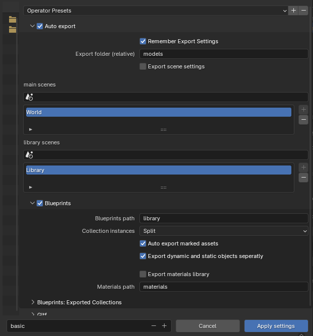
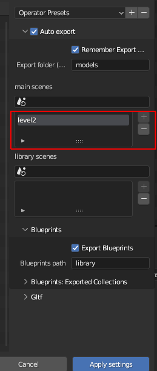

## Usage: 

> ***IMPORTANT***

if you have used a version of this add-on prior to v0.9, there was an issue that kept generating orphan (junk) data on every save !
You can easilly clean up that data 

- go to orphan data:

- click on purge

- validate

This issue has been resolved in v0.9.

### Basics

* before it can automatically save to gltf, you need to configure it
* go to file => export => gltf auto export

* set the autoexport parameters  in the **auto export** panel: 

    

    - export folder: root folder to export models too

    - pick your main (level) scenes and/or library scenes (see the chapter about [Blueprints](#blueprints) and [multiple Blend filles workflow](#multiple-blend-file-workflow) below)   
        - click in the scene picker & select your scene

        

        - click on the "+" icon

        

        - your scene is added to the list
        
         

    - blueprints path: the path to export blueprints to , relative to the main **export folder** (default: library)

        please read the dedicated [section](#collection-instances--nested-blueprints) below for more information

- there are some workflow specificities for multi blend file [workflows](#multiple-blend-file-workflow)

#### Collection instances & Nested blueprints

To maximise reuse of meshes/components etc, you can also nest ***collections instances*** inside collections (as normally in Blender), but also export each nested Blueprint as a seperate blueprints.

> Don't forget to choose the relevant option in the exporter settings (aka **"split"**)

> This replaces the previous "export nested blueprints" checkbox/ option

- To make things clearer: 

    

    - **Player2** & **Enemy** both use the **Humanoid_cactus** nested collection/blueprint, so **Humanoid_cactus** gets exported as a Blueprint for re-use ...but
    - **Humanoid_cactus** is also made up of a main mesh & two instances of **Hand** , so **Hand** gets exported as a Blueprint for re-use ...but
    - **Hand** is also made up of a main mesh & three instances of **Finger**, so **Finger** gets exported as a Blueprint for re-use

- The exported models in this case end up being:

    

    - Note how **Player2.glb** is tiny, because most of its data is actually sotred in **Humanoid_cactus.glb**
    - **Enemy.glb** is slightly bigger because that blueprints contains additional meshes
    - All the intermediary blueprints got exported automatically, and all instances have been replaced with "empties" (see explanation in the **Process section** ) to minimize file size

- Compare this to the output **WITHOUT** the nested export option:

    

    - less blueprints as the sub collections that are not in use somewhere directly are not exported
    - **Player2.glb** & **Enemy.glb** are significantly larger

TLDR: smaller, more reuseable blueprints which can share sub-parts with other entities !

### Create components from custom properties

- IF you have a valid component type  and the correct corresponding RON string in the custom_property value (this button will not appear if not), this add-on can automatically
generate the corresponding component for you:

- Fill/check your custom property (here for Aabb) 

- click on the button

-voila !

## Use

### Existing components & custom properties

* If you already have components defined manualy in Blender inside **custom properties** you will need to define them again using the UI!
* avoid mixing & matching: if you change the values of **custom properties** that also have a component, the custom property will be **overriden** every time
you change the component's value
* you can of course still use non component custom properties as always, this add-on will only impact those that have corresponding Bevy components

  

## Advanced Tools

In this section you will find various additional more advanced tooling

### Invalid/unregistered type renaming / conversion

If you have components that are
  * invalid : ie some error was diagnosed
  * unregistered: a custom property is present on the object, but there is no matching type in the registry

Here you will get an overview, of ALL invalid and unregistered components in your Blender project, so you can find them, rename/convert them,
or delete them, also in bulk

* you can click on the button to select the object in your outliner (this also works across scenes, so you will be taken to the scene where the
given object is located)

#### Single object component renaming/ conversion

  - to rename/convert a single component for a single object:
    
    * go to the row of the object you want to convert the component of
    * in the dropdown menu, choose the target component
    * click on the button with the magic wand to convert the component

       

  > the tool will attempt to automatically convert the source component, including the field names/values, if the target component has the same ones
    If it fails to do the conversion, you will get an error message, and you will either have to change the custom property yourself, or you can simply
    change the values in the UI, which will automatically generate the custom property value

  - to delete a single component for a single object:

    * go to the row of the object you want to remove the component from
    * click on the button with the "x" to remove the component  

       

#### Bulk component renaming/ conversion

  - use this method if you want to convert ALL components of a given type of ALL objects 

    * click on this button to pick your source component

      

    * for conversion: in the dropdown menu, choose the target component & click apply to convert all matching components
    * for deletion: clic on the "x" to remove all matching components

      

 ### For conversion between custom properties & components & vice-versa

 #### regenerate custom property values

  - "update custom properties of current object" : will go over **all components** that you have defined for the **currently selected object**, and re-generate the 

    corresponding custom property values 

     

  - "update custom properties of ALL objects" : same as above but it will do so for the **ALL objects in your blend file** (so can be slow!), and re-generate the 

    corresponding custom property values 

     

     > IMPORTANT !! use this if you have previously used v0.1 or v0.2 , as v0.3 had a breaking change, that makes it **necessary** to use this **once** to upgrade components data
     You should also re-export your gltf files , otherwise you might run into issues

  
  #### regenerate component/ UI values

   - since v0.2, you have the option to regenerate (for the selected object or all objects, as above) to regenerate your UI values from the custom property values

   

   > IMPORTANT !! use this if you have previously used v0.1 , as v0.2 had a breaking change, that makes it **necessary** to use this **once** to upgrade the UI data

## Examples

you can find an example [here](https://github.com/kaosat-dev/Blenvy/tree/main/examples/bevy_registry_export/)

