# gltf_auto_export

This [Blender addon](./)  
- automatically exports your level/world from Blender to gltf whenever you save your Blend file.
- in Blueprints mode (highly recommended !) : 
    - supports automatic exports of used collections as [Gltf blueprints](../../crates/bevy_gltf_blueprints/README.md)
    - supports any number of main/level scenes 
        - Blender scenes where you define your levels, and all collection instances are replaced with "pointers" to other gltf files (all automatic)
    - supports any number of library scenes
        - Blender scenes where you define the assets that you use in your levels, in the form of collections
    - automatic export of **changed** objects & collections only ! a sort of "incremental export", where only the changed collections (if in use)
        get exported when you save your blend file
   

## Installation: 

* in Blender go to edit =>  preferences => install

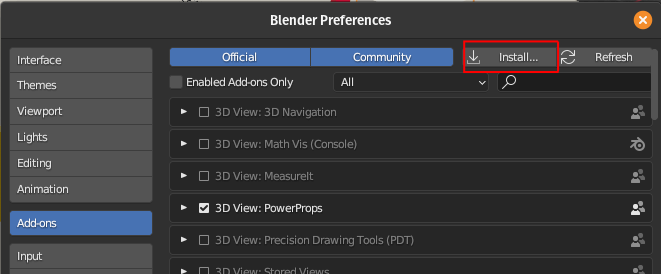

* choose the path where ```gltf_auto_export.zip``` is stored


## Usage: 


### Basics

* before it can automatically save to gltf, you need to configure it
* go to file => export => gltf auto export

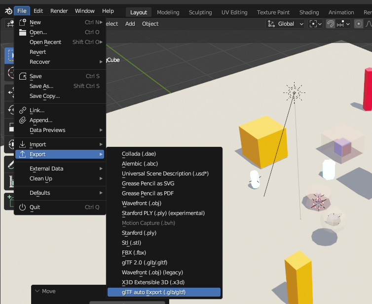

* set the autoexport parameters  in the **auto export** panel: 

    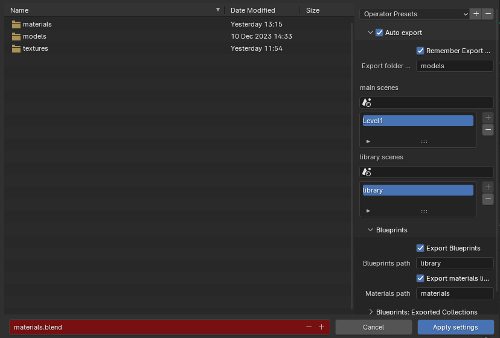


    - export folder: root folder to export models too
    - pick your main (level) scenes and library scenes (see the chapter about Blueprints below)   
        - click in the scene picker & select your scene

        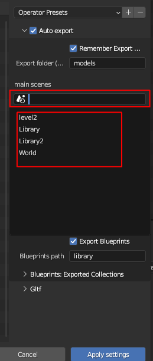

        - click on the "+" icon

        

        - your scene is added to the list
        
        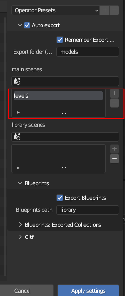 

    - export blueprints: check this if you want to automatically export blueprints (default: True)
    - blueprints path: the path to export blueprints to , relative to the main **export folder** (default: library)

    - export materials library: check this if you want to automatically export material libraries (default: False)
    please read the dedicated section below for more information

        > This only works together with blueprints !

    - materials path: where to export materials to

* and your standard gltf export parameters in the **gltf** panel


* click on "apply settings"
* now next time you save your blend file you will get an automatically exported gltf file (or more than one, depending on your settings, see below)

### Blueprints

You can enable this option to automatically replace all the **collection instances** inside your main scene with blueprints
- whenever you change your main scene (or your library scene , if that option is enabled), all your collection instances 
    * will be replaced with empties (this will not be visible to you)
    * those empties will have additional custom properties / components : ```BlueprintName``` & ```SpawnHere```
    * your main scene/ level will be exported to a much more trimmed down gltf file (see next point)
    * all the original collections (that you used to create the instances) will be exported as **seperate gltf files** into the "library" folder

- this means you will have 
    * one small main gltf file (your level/world)
    * as many gltf files as you have used collections in the main scene , in the library path you specified :
    for the included [basic](../../examples/bevy_gltf_blueprints/basic/) example's [assets](../../examples/bevy_gltf_blueprints/basic/assets/), it looks something like this: 

    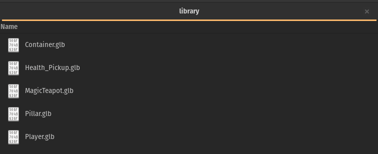
    
    the .blend file that they are generated from can be found [here](../../examples/bevy_gltf_blueprints/basic/assets/advanced.blend)

- the above only applies to collections that have **instances** in your main scene!
    if you want a specific collection in your library to always get exported regardless of its use, you need to add 
    a **COLLECTION** (boolean) custom property called ```AutoExport``` set to true
    > not at the object level ! the collection level !

    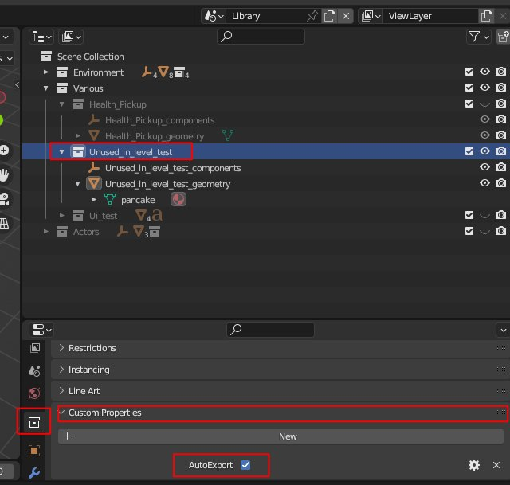

    It will get automatically exported like any of the "in-use" collections.

- you can also get an overview of all the exported collections in the export menu

    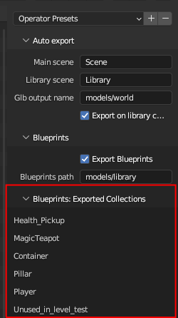

### Materials

You can enable this option to automatically generate a **material library** file that combines all the materials in use in your blueprints.


Since each blueprint is normally a completely independant gltf file, without this option, if you have a material with a large texture for example, 
**ALL** of your blueprints using that material will embed that large texture, leading to **significant bloat & memory use**.


- When this option is enabled, you get a single material library per Blender project, and a **MaterialInfo** component is inserted into each object using a material.
- The correct material will then be inserted on the Bevy side (that loads any number of material libraries that you need) into the correct mesh (see the configuration
options in **bevy_gltf_blueprints** for more information on that)
- Only one material per object is supported at this stage, ie the last material slot's material is the one that is going to be used

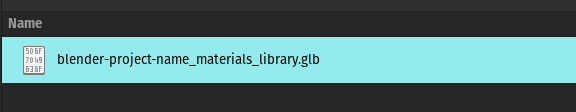

TLDR: Use this option to make sure that each blueprint file does not contain a copy of the same materials 


#### Process

This is the internal logic of the export process with blueprints 


ie this is an example scene...

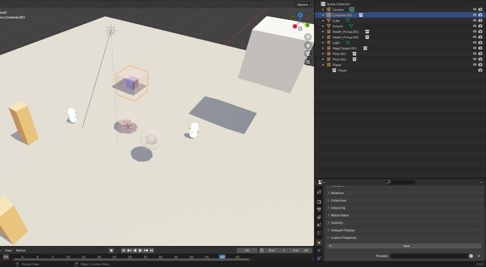

and what actually gets exported for the main scene/world/level

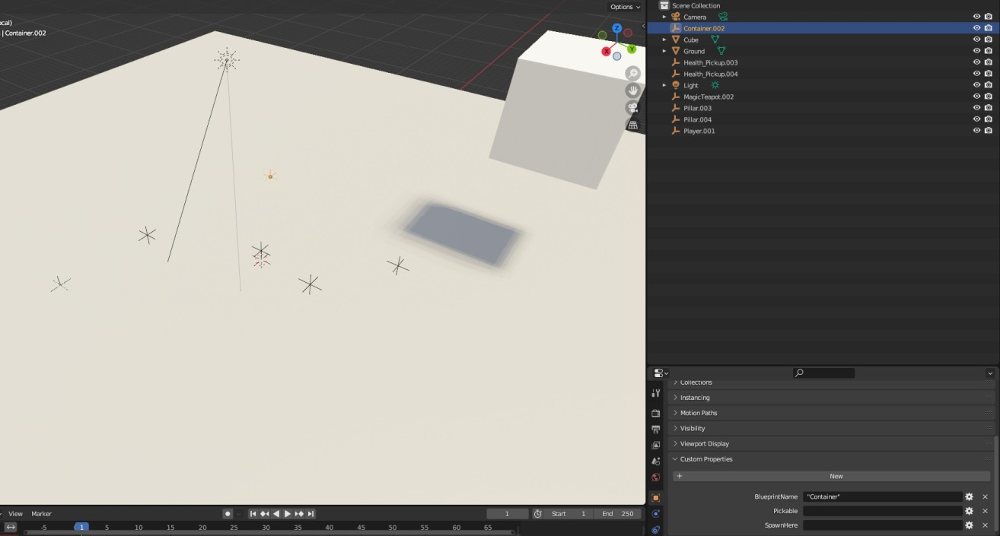

all collections instances replaced with empties, and all those collections exported to gltf files as seen above


## Development 

- since the code has now been split up into multiple modules, to make your life easier, I highly recomend (if you are using vscode like me) to use 
[this](https://marketplace.visualstudio.com/items?itemName=JacquesLucke.blender-development) excellent extension , works easilly and fast , even for the latest 
versions of Blender (v4.0 as of this writing)
- this [article](https://polynook.com/learn/set-up-blender-addon-development-environment-in-windows) might also help out 
(easy enough to get it working on linux too)

## License

This tool, all its code, contents & assets is Dual-licensed under either of

- Apache License, Version 2.0, ([LICENSE-APACHE](../LICENSE_APACHE.md) or https://www.apache.org/licenses/LICENSE-2.0)
- MIT license ([LICENSE-MIT](../LICENSE_MIT.md) or https://opensource.org/licenses/MIT)