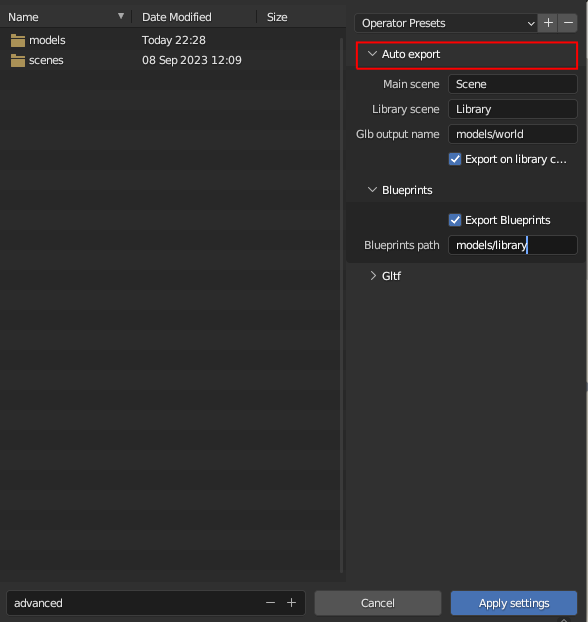
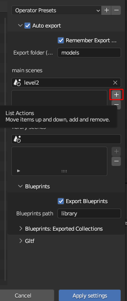
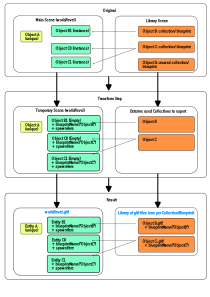

# gltf_auto_export

For convenience I also added this [Blender addon](./gltf_auto_export.py) that 
- automatically exports your level/world from Blender to gltf whenever you save your Blend file.
- in Blueprints mode (highly recommended !) : 
    - supports automatic exports of used collections as [Gltf blueprints](../../crates/bevy_gltf_blueprints/README.md)
    - supports any number of main/level scenes 
        - Blender scenes where you define your levels, and all collection instances are replaced with "pointers" to other gltf files (all automatic)
    - supports any number of library scenes
        - Blender scenes where you define the assets that you use in your levels, in the form of collections
    - automatic export of **changed** objects & collections only ! a sort of "incremental export", where only the changed collections (if in use)
        get exported when you save your blend file
   

## Installation: 

* in Blender go to edit =>  preferences => install


* choose the path where ```gltf_auto_export/gltf_auto_export.py``` is stored


## Usage: 


### Basics

* before it can automatically save to gltf, you need to configure it
* go to file => export => gltf auto export


* set the autoexport parameters  in the **auto export** panel: 

    


    - export folder
    - pick your main (level) scenes and library scenes (see the chapter about Blueprints below)   
        - click in the scene picker & select your scene

        

        - click on the "+" icon

        

        - your scene is added to the list
        
         


* and your standard gltf export parameters in the **gltf** panel


* click on "apply settings"
* now next time you save your blend file you will get an automatically exported gltf file (or more than one, depending on your settings, see below)

### Blueprints

You can enable this option to automatically replace all the **collection instances** inside your main scene with blueprints
- whenever you change your main scene (or your library scene , if that option is enabled), all your collection instances 
    * will be replaced with empties (this will not be visible to you)
    * those empties will have additional custom properties / components : ```BlueprintName``` & ```SpawnHere```
    * your main scene/ level will be exported to a much more trimmed down gltf file (see next point)
    * all the original collections (that you used to create the instances) will be exported as **seperate gltf files** into the "library" folder

- this means you will have 
    * one small main gltf file (your level/world)
    * as many gltf files as you have used collections in the main scene , in the library path you specified :
    for the included [advanced](../../examples/advanced/) example's [assets](../../assets/advanced/models/), it looks something like this: 

    
    
    the .blend file that they are generated from can be found [here](../../assets/advanced/advanced.blend)

- the above only applies to collections that have **instances** in your main scene!
    if you want a specific collection in your library to always get exported regardless of its use, you need to add 
    a **COLLECTION** (boolean) custom property called ```AutoExport``` set to true
    > not at the object level ! the collection level !

    

    It will get automatically exported like any of the "in-use" collections.

- you can also get an overview of all the exported collections in the export menu

    

#### Process

This is the internal logic of the export process with blueprints 



ie this is an example scene...


and what actually gets exported for the main scene/world/level


all collections instances replaced with empties, and all those collections exported to gltf files as seen above

## License

This tool, all its code, contents & assets is Dual-licensed under either of

- Apache License, Version 2.0, ([LICENSE-APACHE](../LICENSE_APACHE.md) or https://www.apache.org/licenses/LICENSE-2.0)
- MIT license ([LICENSE-MIT](../LICENSE_MIT.md) or https://opensource.org/licenses/MIT)